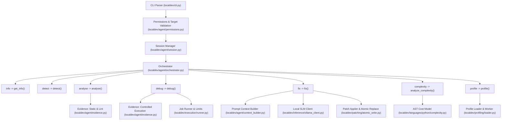

# localdev CLI Command Reference & Architectural Execution Paths

`localdev` is an offline, native Windows 11 x64 coding agent designed for deterministic inspection, static analysis, runtime debugging, guarded repair, algorithmic complexity estimation, and hot-process profiling of single Python source files.

This document details the operational mechanics, execution flow, options, error handling, exit codes, and exact source code file paths implementing every command supported by `localdev`.

---

## Architecture Overview & Subsystem Map

Each command enters through the CLI parser in [`localdev/cli.py`](file:///d:/Project/Coding_Agent/localdev/cli.py), validates target access via [`localdev/agent/permissions.py`](file:///d:/Project/Coding_Agent/localdev/agent/permissions.py), initializes an isolated session via [`localdev/agent/session.py`](file:///d:/Project/Coding_Agent/localdev/agent/session.py), and delegates to [`Orchestrator`](file:///d:/Project/Coding_Agent/localdev/agent/orchestrator.py#L42) in [`localdev/agent/orchestrator.py`](file:///d:/Project/Coding_Agent/localdev/agent/orchestrator.py).



---

## Global Options

All commands accept the following global options defined in [`create_parser()`](file:///d:/Project/Coding_Agent/localdev/cli.py#L216):

| Flag | Type | Description |
|---|---|---|
| `-h`, `--help` | Flag | Displays the CLI help text for the command and exits with code `0`. |
| `--json` | Flag | Emits machine-readable RFC 8259 JSON (`schema_version: "1.0"`) on `stdout`. Disables terminal styling. Stderr retains interactive notices. |
| `--keep-session` | Flag | Prevents automatic deletion of the temporary session folder (`%TEMP%\localdev\session_<id>`) upon process exit. Useful for diagnosing relocated script behavior. |
| `--version` | Flag | Emits `localdev <version>` and exits with code `0`. |

---

## Target Selector Syntax

Commands that inspect or execute whole files accept a single target file path:
```powershell
localdev <command> path/to/script.py
```

The [`complexity`](file:///d:/Project/Coding_Agent/localdev/cli.py#L398) and [`profile`](file:///d:/Project/Coding_Agent/localdev/cli.py#L410) commands additionally accept double-colon (`::`) function and method selectors parsed by [`parse_selector`](file:///d:/Project/Coding_Agent/localdev/cli.py#L90):
- **Function Selector:** `script.py::function_name`
- **Method Selector:** `script.py::ClassName.method_name`

Providing selectors to whole-file commands (`info`, `detect`, `analyse`, `debug`, `fix`) triggers [`CliUsageError`](file:///d:/Project/Coding_Agent/localdev/errors.py#L7) (Exit code `2`).

---

## Command 1: `info`

### 1.1 Synopsis
```powershell
localdev info <target> [--json] [--keep-session]
```

### 1.2 Purpose & How It Works
`localdev info` gathers and displays comprehensive file system and encoding metadata for a single target Python script without executing any code or creating background child processes.

**Execution Flow:**
1. **Target Validation:** [`validate_target`](file:///d:/Project/Coding_Agent/localdev/agent/permissions.py#L82) resolves canonical absolute pathing, verifies existence, checks that the target is a regular file, rejects reparse points (symbolic links and NTFS junctions), and verifies read access.
2. **Metadata Extraction:**
   - Detects PEP 263 coding declaration (e.g. `# -*- coding: utf-8 -*-`) using regex in [`detect_encoding_and_bom`](file:///d:/Project/Coding_Agent/localdev/agent/permissions.py#L35).
   - Detects UTF-8, UTF-16-LE, and UTF-16-BE Byte Order Marks (BOM).
   - Determines line-ending style (`CRLF`, `LF`, or `MIXED`) via [`detect_line_endings`](file:///d:/Project/Coding_Agent/localdev/agent/permissions.py#L58).
   - Calculates SHA-256 cryptographic digest of the raw bytes.
   - Computes total physical line count.
   - Checks NTFS read-only attributes and volume root.
3. **Non-Executing Language Detection:** Evaluates target classification using [`detect_confidence`](file:///d:/Project/Coding_Agent/localdev/languages/python/adapter.py#L46).
4. **Rendering:** Formats the [`TargetInfoRecord`](file:///d:/Project/Coding_Agent/localdev/schemas.py#L182) as a clean ANSI-sanitized terminal summary via [`render_info`](file:///d:/Project/Coding_Agent/localdev/reporting/terminal.py#L65) or wraps it in [`JsonEnvelope`](file:///d:/Project/Coding_Agent/localdev/schemas.py#L353).

### 1.3 Implementation Source Paths
- **CLI Definition & Dispatch:** [`localdev/cli.py`](file:///d:/Project/Coding_Agent/localdev/cli.py#L260) (`p_info`, lines 580–594)
- **Target Permissions & Encodings:** [`localdev/agent/permissions.py`](file:///d:/Project/Coding_Agent/localdev/agent/permissions.py) (`validate_target`, `detect_encoding_and_bom`, `detect_line_endings`)
- **Orchestration:** [`localdev/agent/orchestrator.py`](file:///d:/Project/Coding_Agent/localdev/agent/orchestrator.py#L100) (`get_info`)
- **Schema Model:** [`localdev/schemas.py`](file:///d:/Project/Coding_Agent/localdev/schemas.py#L182) (`TargetInfoRecord`, `TargetRecord`)
- **Terminal Formatter:** [`localdev/reporting/terminal.py`](file:///d:/Project/Coding_Agent/localdev/reporting/terminal.py#L65) (`render_info`)

### 1.4 Exit Codes
- `0` (`EXIT_SUCCESS`): Target metadata collected successfully.
- `2` (`EXIT_CLI_USAGE_ERROR`): Missing target path, unrecognized flag, or malformed syntax.
- `3` (`EXIT_TARGET_IO_ERROR`): File not found, permission denied, or target is a symlink/junction.

---

## Command 2: `detect`

### 2.1 Synopsis
```powershell
localdev detect <target> [--json] [--keep-session]
```

### 2.2 Purpose & How It Works
`localdev detect` performs non-executing classification to determine whether the target source file is a supported Python module or an unsupported language.

**Execution Flow:**
1. **Validation:** Calls [`validate_target`](file:///d:/Project/Coding_Agent/localdev/agent/permissions.py#L82) to ensure target accessibility.
2. **Confidence-Tiered Classification:** [`PythonAdapter.detect_confidence`](file:///d:/Project/Coding_Agent/localdev/languages/python/adapter.py#L46) applies three classification layers:
   - **`CERTAIN`**: File extension is `.py` or `.pyw`, and the file parses cleanly with `compile(source, filename, "exec", flags=ast.PyCF_ONLY_AST)`.
   - **`PROBABLE`**: File extension is `.py`/`.pyw` with syntax errors, OR extensionless file with a valid Python shebang line (e.g., `#!/usr/bin/env python3`).
   - **`UNSUPPORTED`**: Any non-Python file extension (e.g. `.js`, `.cpp`, `.rs`) or binary files.
3. **Rendering:** Returns [`DetectionResult`](file:///d:/Project/Coding_Agent/localdev/schemas.py#L38) displaying the language identifier, confidence tier (`CERTAIN`, `PROBABLE`, `UNSUPPORTED`), and matching criteria.

### 2.3 Implementation Source Paths
- **CLI Definition & Dispatch:** [`localdev/cli.py`](file:///d:/Project/Coding_Agent/localdev/cli.py#L269) (`p_detect`, lines 595–609)
- **Language Adapter Registry:** [`localdev/languages/base.py`](file:///d:/Project/Coding_Agent/localdev/languages/base.py#L146) (`AdapterRegistry`, `LanguageAdapter`)
- **Python Classification Logic:** [`localdev/languages/python/adapter.py`](file:///d:/Project/Coding_Agent/localdev/languages/python/adapter.py#L46) (`detect_confidence`)
- **AST Trial Compilation:** [`localdev/languages/python/syntax.py`](file:///d:/Project/Coding_Agent/localdev/languages/python/syntax.py#L109) (`compile_ast_only`)
- **Terminal Formatter:** [`localdev/reporting/terminal.py`](file:///d:/Project/Coding_Agent/localdev/reporting/terminal.py#L90) (`render_detect`)

### 2.4 Exit Codes
- `0` (`EXIT_SUCCESS`): Detection executed cleanly (regardless of whether the target was classified as supported or unsupported).
- `2` (`EXIT_CLI_USAGE_ERROR`): Invalid command line arguments.
- `3` (`EXIT_TARGET_IO_ERROR`): Target unreadable or nonexistent.

---

## Command 3: `analyse`

### 3.1 Synopsis
```powershell
localdev analyse <target> [--diagnose] [--model <id>] [--fallback] [--json] [--keep-session]
```

### 3.2 Purpose & How It Works
`localdev analyse` runs deterministic, non-executing static analysis on a Python target. It validates Python AST syntax, extracts structural metadata, runs isolated Ruff linting, and optionally queries a local SLM for evidence-grounded bug diagnosis.

**Execution Flow:**
1. **Syntax Checking:** Reads target source bytes and invokes [`compile_ast_only`](file:///d:/Project/Coding_Agent/localdev/languages/python/syntax.py#L109) with `sys.dont_write_bytecode = True`. Syntax errors produce a structured [`DiagnosticRecord`](file:///d:/Project/Coding_Agent/localdev/schemas.py#L52) with 1-based line/column pointers.
2. **AST Fact Extraction:** [`extract_ast_facts_from_source`](file:///d:/Project/Coding_Agent/localdev/languages/python/ast_analyser.py#L432) traverses the AST tree to extract:
   - Function definitions, parameter names, line spans, and return statements.
   - Class definitions, bases, and method definitions.
   - Import statements (`import x`, `from x import y`).
   - Call expressions, loops (`for`, `while`), and branch points (`if`, `match`).
3. **Isolated Ruff Linter:** [`run_ruff_diagnostics`](file:///d:/Project/Coding_Agent/localdev/linting/ruff.py#L42) invokes `ruff check --no-cache --isolated --output-format=json` against the target. Disables ambient configuration inheritance to guarantee reproducible lint results.
4. **Optional Local SLM Diagnosis (`--diagnose`):**
   - Context Assembly: [`build_diagnosis_context`](file:///d:/Project/Coding_Agent/localdev/agent/context_builder.py#L22) builds a compact prompt within a strict token budget (<= 1,200 tokens).
   - Inference: Connects to local Ollama via [`OllamaClient`](file:///d:/Project/Coding_Agent/localdev/inference/ollama_client.py#L42) (default: `qwen2.5-coder:3b-instruct-q4_K_M` or `--fallback` `qwen2.5-coder:1.5b-instruct-q4_K_M`).
   - Strict Schema Validation: [`execute_diagnosis_with_retry`](file:///d:/Project/Coding_Agent/localdev/inference/response_validator.py#L26) validates the model's JSON response against [`DiagnosisRecord`](file:///d:/Project/Coding_Agent/localdev/schemas.py#L110) with one automated retry on validation error.
5. **Report Generation:** Produces an [`AnalysisReport`](file:///d:/Project/Coding_Agent/localdev/schemas.py#L85).

### 3.3 Implementation Source Paths
- **CLI Definition & Dispatch:** [`localdev/cli.py`](file:///d:/Project/Coding_Agent/localdev/cli.py#L278) (`p_analyse`, lines 610–638)
- **Orchestration:** [`localdev/agent/orchestrator.py`](file:///d:/Project/Coding_Agent/localdev/agent/orchestrator.py#L272) (`analyse`, `diagnose`)
- **Evidence Collection:** [`localdev/agent/evidence.py`](file:///d:/Project/Coding_Agent/localdev/agent/evidence.py#L38) (`collect_analysis_evidence`)
- **Syntax Validation:** [`localdev/languages/python/syntax.py`](file:///d:/Project/Coding_Agent/localdev/languages/python/syntax.py#L109) (`compile_ast_only`, `decode_source`)
- **AST Fact Extraction:** [`localdev/languages/python/ast_analyser.py`](file:///d:/Project/Coding_Agent/localdev/languages/python/ast_analyser.py#L82) (`ASTFactExtractor`)
- **Isolated Ruff Linter:** [`localdev/linting/ruff.py`](file:///d:/Project/Coding_Agent/localdev/linting/ruff.py#L42) (`run_ruff_diagnostics`)
- **SLM Context Assembly:** [`localdev/agent/context_builder.py`](file:///d:/Project/Coding_Agent/localdev/agent/context_builder.py#L22) (`build_diagnosis_context`)
- **SLM Client & Validation:** [`localdev/inference/ollama_client.py`](file:///d:/Project/Coding_Agent/localdev/inference/ollama_client.py#L42), [`localdev/inference/response_validator.py`](file:///d:/Project/Coding_Agent/localdev/inference/response_validator.py#L26)
- **Terminal Formatter:** [`localdev/reporting/terminal.py`](file:///d:/Project/Coding_Agent/localdev/reporting/terminal.py#L115) (`render_analyse`)

### 3.4 Exit Codes
- `0` (`EXIT_SUCCESS`): Target has valid syntax and static analysis completed.
- `1` (`EXIT_TARGET_FAILURE`): Syntax error found in target file.
- `2` (`EXIT_CLI_USAGE_ERROR`): CLI argument parsing error.
- `3` (`EXIT_TARGET_IO_ERROR`): Target unreadable.
- `5` (`EXIT_INFERENCE_ERROR`): Local Ollama service unreachable when `--diagnose` was requested.

---

## Command 4: `debug`

### 4.1 Synopsis
```powershell
localdev debug <target> [-i <input_data>] [--stdin-file <path>] [--timeout <sec>] 
              [--fail-on-job-failure] [--diagnose] [--model <id>] [--fallback] 
              [--json] [--keep-session] [-- <args>...]
```

### 4.2 Purpose & How It Works
`localdev debug` executes the target Python script in an isolated runtime environment (`python.exe -E -B -P`) governed by operating system containment limits, captures standard output, drains standard error, parses runtime tracebacks, extracts normalized error signatures, and optionally diagnoses crashes with local SLM inference.

**Execution Flow:**
1. **Pre-Execution Input Resolution ([`resolve_execution_inputs`](file:///d:/Project/Coding_Agent/localdev/cli.py#L565)):**
   - AST Scan: [`detect_input_requirements`](file:///d:/Project/Coding_Agent/localdev/languages/python/ast_analyser.py#L473) inspects target source AST for calls to `input()` or `sys.stdin`.
   - Resolution Priority:
     1. Literal `-i` / `--input` argument (supports decoded `\n`).
     2. `--stdin-file` supplying input from a file.
     3. Non-blocking Win32 stream check (`stat.S_ISFIFO` with `PeekNamedPipe` and `stat.S_ISREG` with `st_size > 0`).
     4. Interactive Terminal: If `sys.stdin.isatty()` is True and inputs are required, prompts the user line-by-line (using detected AST prompts) before execution.
     5. Non-interactive fallback: Returns `(None, None)` to prevent hangs.
2. **Session Relocation:** [`Session`](file:///d:/Project/Coding_Agent/localdev/agent/session.py#L45) copies the target script into a clean temporary directory (`%TEMP%\localdev\session_<id>\session_target.py`).
3. **Execution Request Construction:** [`build_execution_request`](file:///d:/Project/Coding_Agent/localdev/execution/runner.py#L40) sets up:
   - Binary: `sys.executable` with flags `-E`, `-B`, `-P`.
   - Cwd: Invocation working directory (preserving relative path lookups).
   - Environment: Whitelisted essential environment variables only.
   - Script Arguments: Arguments passed after `--` on the CLI.
4. **Subprocess Containment & Limits:**
   - Windows Job Object: [`WindowsJobObject`](file:///d:/Project/Coding_Agent/localdev/execution/windows_job.py#L56) binds the subprocess tree with `JOB_OBJECT_LIMIT_KILL_ON_JOB_CLOSE`.
   - Memory Monitoring: [`ProcessTreeMemoryMonitor`](file:///d:/Project/Coding_Agent/localdev/execution/process_memory.py#L42) samples external process tree RSS at 20 ms intervals (50 Hz).
   - Async Pipe Draining: [`PipeDrainer`](file:///d:/Project/Coding_Agent/localdev/execution/runner.py#L82) concurrently drains `stdout`, `stderr`, and writes `stdin_data` via separate worker threads. Caps combined output at 512 KB to prevent buffer deadlocks.
   - Timeout: Wall-clock watchdog (default: 10.0s).
5. **Traceback Parsing:** [`parse_traceback`](file:///d:/Project/Coding_Agent/localdev/languages/python/traceback_parser.py#L32) decomposes Python tracebacks into structured frames, remaps relocated temporary session paths back to the user's canonical target path, and separates target-code frames from external library frames.
6. **Error Signature Extraction:** Extracts normalized `(exception_type, normalized_message, top_target_file, top_target_line)`.
7. **Optional Diagnosis (`--diagnose`):** Invokes local SLM with execution evidence, error signatures, and relevant frame source snippets.

### 4.3 Implementation Source Paths
- **CLI Parser & Pre-execution Input Resolution:** [`localdev/cli.py`](file:///d:/Project/Coding_Agent/localdev/cli.py#L301) (`p_debug`, `resolve_execution_inputs`, lines 768–812)
- **AST Input Scanner:** [`localdev/languages/python/ast_analyser.py`](file:///d:/Project/Coding_Agent/localdev/languages/python/ast_analyser.py#L473) (`detect_input_requirements`, `InputRequirement`)
- **Temporary Session:** [`localdev/agent/session.py`](file:///d:/Project/Coding_Agent/localdev/agent/session.py#L45) (`Session`)
- **Subprocess Runner & Draining:** [`localdev/execution/runner.py`](file:///d:/Project/Coding_Agent/localdev/execution/runner.py#L125) (`run_execution_request`, `build_execution_request`, `PipeDrainer`)
- **Windows Job Object Containment:** [`localdev/execution/windows_job.py`](file:///d:/Project/Coding_Agent/localdev/execution/windows_job.py#L56) (`WindowsJobObject`)
- **Process Memory Monitor:** [`localdev/execution/process_memory.py`](file:///d:/Project/Coding_Agent/localdev/execution/process_memory.py#L42) (`ProcessTreeMemoryMonitor`)
- **Traceback Parser:** [`localdev/languages/python/traceback_parser.py`](file:///d:/Project/Coding_Agent/localdev/languages/python/traceback_parser.py#L32) (`parse_traceback`, `ErrorSignature`)
- **Orchestration:** [`localdev/agent/orchestrator.py`](file:///d:/Project/Coding_Agent/localdev/agent/orchestrator.py#L297) (`debug`)
- **Terminal Formatter:** [`localdev/reporting/terminal.py`](file:///d:/Project/Coding_Agent/localdev/reporting/terminal.py#L182) (`render_debug`)

### 4.4 Exit Codes
- `0` (`EXIT_SUCCESS`): Subprocess ran and exited with return code `0`.
- `1` (`EXIT_TARGET_FAILURE`): Target script crashed with an unhandled exception or non-zero exit code.
- `2` (`EXIT_CLI_USAGE_ERROR`): Unrecognized option or invalid syntax.
- `3` (`EXIT_TARGET_IO_ERROR`): Target script inaccessible.
- `4` (`EXIT_TIMEOUT_RESOURCE_BREACH`): Execution timed out (> 10s default) or exceeded output cap.

---

## Command 5: `fix`

### 5.1 Synopsis
```powershell
localdev fix <target> [--apply] [--propose-only] [-i <input_data>] [--stdin-file <path>]
            [--expected-stdout <str>] [--expected-stdout-contains <str>] [--expected-exit <code>]
            [--timeout <sec>] [--fail-on-job-failure] [--model <id>] [--fallback]
            [--json] [--keep-session] [-- <args>...]
```

### 5.2 Purpose & How It Works
`localdev fix` orchestrates an automated diagnosis and repair cycle: reproduces the failure, queries local SLM for a structured patch proposal, validates candidate correctness against 4 empirical levels (A–D), and atomically updates the file on disk using native Win32 `ReplaceFileW`.

**Execution Flow:**
1. **Deterministic Baseline Reproduction:**
   - Gathers static findings via `analyse()` and runtime findings via `debug()`.
   - If the code has zero syntax errors, zero linter diagnostics, exits 0, and satisfies behavioral assertions, reports "No defect detected" and terminates without calling the model.
2. **Local SLM Diagnosis & Edit Proposal:**
   - Prompt Assembly: [`build_edit_proposal_context`](file:///d:/Project/Coding_Agent/localdev/agent/context_builder.py#L105) packages baseline evidence, traceback frames, and relevant source lines within prompt token constraints.
   - Structured Output: Generates JSON complying with [`EditProposalRecord`](file:///d:/Project/Coding_Agent/localdev/schemas.py#L254), specifying exact line replacements, deletions, or insertions.
   - Automated Single Retry: [`execute_edit_proposal_with_retry`](file:///d:/Project/Coding_Agent/localdev/inference/response_validator.py#L125) validates the proposal. If lines do not match target source or AST parsing fails, a single targeted retry is triggered with specific feedback.
3. **In-Memory Candidate Application:**
   - [`apply_edits_to_source`](file:///d:/Project/Coding_Agent/localdev/patching/patch_applier.py#L25) constructs a [`PatchCandidate`](file:///d:/Project/Coding_Agent/localdev/patching/patch_applier.py#L82) without touching disk.
4. **Empirical Validation Gates (Levels A–D):**
   - The candidate is evaluated through [`validate_candidate`](file:///d:/Project/Coding_Agent/localdev/languages/python/adapter.py#L147):
     - **Level A (Static Validity):** Candidate parses cleanly into a valid AST and introduces zero new linter findings. Pre-existing static findings must be eliminated.
     - **Level B (Failure Reproduction Removed):** The candidate script no longer reproduces the baseline runtime error signature `(exception_type, message, line)`.
     - **Level C (Clean Execution):** The candidate script executes under controlled limits and exits cleanly with exit code `0`.
     - **Level D (Behavioral Correctness):** Candidate execution satisfies user-provided assertions (`--expected-stdout`, `--expected-stdout-contains`, `--expected-exit`).
5. **Atomic Disk Replacement:**
   - If `--propose-only` is set, displays the diff and validation outcome and exits cleanly without modifying the file.
   - If authorized via `--apply` or interactive prompt confirmation (`[y/N]`):
     - **Same-Volume Staging:** Writes the candidate into a hidden directory on the same logical volume (`<volume>\.localdev_staging\atomic_replace\candidate.py`).
     - **Compare-Before-Replace Check:** Recalculates target SHA-256 to guarantee the file was not modified externally since command start.
     - **Win32 ReplaceFileW:** Calls native Windows `ReplaceFileW` kernel API to perform an atomic NTFS directory-entry swap. Optionally creates a `<target>.bak` backup.

### 5.3 Implementation Source Paths
- **CLI Parser & Flags:** [`localdev/cli.py`](file:///d:/Project/Coding_Agent/localdev/cli.py#L341) (`p_fix`, lines 813–872)
- **Fix Workflow Orchestration:** [`localdev/agent/orchestrator.py`](file:///d:/Project/Coding_Agent/localdev/agent/orchestrator.py#L617) (`fix`, `propose_fix`, `validate_candidate`)
- **Prompt Assembly:** [`localdev/agent/context_builder.py`](file:///d:/Project/Coding_Agent/localdev/agent/context_builder.py#L105) (`build_edit_proposal_context`)
- **Patch Application & In-Memory Candidate:** [`localdev/patching/patch_applier.py`](file:///d:/Project/Coding_Agent/localdev/patching/patch_applier.py#L25) (`apply_edits_to_source`, `PatchCandidate`)
- **Edit Verification:** [`localdev/patching/edit_validator.py`](file:///d:/Project/Coding_Agent/localdev/patching/edit_validator.py#L30) (`validate_edit_proposal`)
- **Multi-Level Validation:** [`localdev/languages/python/adapter.py`](file:///d:/Project/Coding_Agent/localdev/languages/python/adapter.py#L147) (`validate_candidate`)
- **Same-Volume Staging & Atomic ReplaceFileW:** [`localdev/patching/atomic_write.py`](file:///d:/Project/Coding_Agent/localdev/patching/atomic_write.py#L75) (`atomic_replace_file`, `get_same_volume_staging_dir`)
- **Diff Renderer:** [`localdev/patching/diff_renderer.py`](file:///d:/Project/Coding_Agent/localdev/patching/diff_renderer.py#L18) (`render_unified_diff`)
- **Terminal Formatter:** [`localdev/reporting/terminal.py`](file:///d:/Project/Coding_Agent/localdev/reporting/terminal.py#L240) (`render_fix`)

### 5.4 Exit Codes
- `0` (`EXIT_SUCCESS`): Patch applied, proposal reviewed cleanly in propose-only mode, or target was already defect-free.
- `1` (`EXIT_TARGET_FAILURE`): Candidate patch failed validation or write was declined.
- `2` (`EXIT_CLI_USAGE_ERROR`): Invalid command arguments.
- `3` (`EXIT_TARGET_IO_ERROR`): File I/O error or concurrent modification detected (`StaleEditError`).
- `5` (`EXIT_INFERENCE_ERROR`): Ollama service unreachable.
- `6` (`EXIT_ABSTENTION`): Model proposal abstained due to prompt budget limits or cross-file dependencies.

---

## Command 6: `complexity`

### 6.1 Synopsis
```powershell
localdev complexity <target>[::<selector>] [--json] [--keep-session]
```

### 6.2 Purpose & How It Works
`localdev complexity` performs closed-form, non-executing static algorithmic complexity analysis. It infers Big-O time complexity, auxiliary space, and output space under CPython 3.11/3.12 semantics with sound abstention on dynamic constructs.

**Execution Flow:**
1. **Target Selection:** Evaluates either the whole module or an isolated function/method selector (`script.py::function_name` or `script.py::Class.method`).
2. **AST Static Cost Analysis ([`CostModelAnalyzer`](file:///d:/Project/Coding_Agent/localdev/languages/python/complexity.py#L485)):**
   - **Syntax & Call Checking:** Rejects syntax errors and flags unsupported dynamic calls (`eval`, `exec`) or third-party black-box libraries with [`ComplexityAbstentionReason.UNSUPPORTED_CALL`](file:///d:/Project/Coding_Agent/localdev/schemas.py#L295).
   - **Dynamic Loop Bounds:** Checks `while` loops. Halving patterns (e.g. `n //= 2` with no conflicting assignments) evaluate to $O(\log n)$. Data-dependent unbounded loops (such as the Collatz sequence or stateful flags) soundly abstain with [`ComplexityAbstentionReason.DYNAMIC_BOUNDS`](file:///d:/Project/Coding_Agent/localdev/schemas.py#L295).
   - **Loop Nesting & Dimensions:**
     - Single loop over container: $O(n)$.
     - Nested loops over identical dimension: $O(n^2)$.
     - Nested loops over distinct parameters `n` and `m`: $O(nm)$.
     - Three nested loops: $O(n^3)$.
     - Sequential loops: Combined using dominant term algebra via [`combine_addition`](file:///d:/Project/Coding_Agent/localdev/languages/python/complexity.py#L65).
   - **Recursion Inspection:** Distinguishes linear recursion ($O(n)$), divide-and-conquer binary recursion with linear combine ($O(n \log n)$), binary search recursion ($O(\log n)$), and branching Fibonacci-style trees ($O(2^n)$).
   - **Space Separation:**
     - **Auxiliary Space:** Memory used strictly for computation (call stack depth, temporary dictionaries/lists).
     - **Output Space:** Escaping structures returned to the caller.
3. **Closed Complexity Vocabulary:** Enforces strict mathematical classifications:
   `O(1)`, `O(log n)`, `O(n)`, `O(n log n)`, `O(n^2)`, `O(nm)`, `O(n^3)`, `O(2^n)`. Indeterminate forms yield `UNKNOWN` with an explicit technical abstention reason.

### 6.3 Implementation Source Paths
- **CLI Parser & Selector Resolution:** [`localdev/cli.py`](file:///d:/Project/Coding_Agent/localdev/cli.py#L398) (`p_complexity`, `parse_selector`, lines 873–927)
- **Orchestrator Dispatch:** [`localdev/agent/orchestrator.py`](file:///d:/Project/Coding_Agent/localdev/agent/orchestrator.py#L350) (`analyze_complexity`, `analyze_file_complexity`)
- **Complexity Analyzer Engine:** [`localdev/languages/python/complexity.py`](file:///d:/Project/Coding_Agent/localdev/languages/python/complexity.py#L485) (`CostModelAnalyzer`, `analyze_function_complexity`, `analyze_file_complexity`)
- **Schema Model:** [`localdev/schemas.py`](file:///d:/Project/Coding_Agent/localdev/schemas.py#L290) (`ComplexityReport`, `ComplexityClassEnum`, `ComplexityAbstentionReason`)
- **Terminal Formatter:** [`localdev/reporting/terminal.py`](file:///d:/Project/Coding_Agent/localdev/reporting/terminal.py#L295) (`render_complexity`)

### 6.4 Exit Codes
- `0` (`EXIT_SUCCESS`): Complexity established for all evaluated targets.
- `1` (`EXIT_TARGET_FAILURE`): Target contains syntax errors.
- `2` (`EXIT_CLI_USAGE_ERROR`): Selector syntax error or malformed identifier.
- `3` (`EXIT_TARGET_IO_ERROR`): Target file unreadable.
- `6` (`EXIT_ABSTENTION`): Static bounds could not be proved mathematically (e.g., dynamic while loop bounds).

---

## Command 7: `profile`

### 7.1 Synopsis
```powershell
localdev profile <target>::<selector> [-i <input_data>] [--stdin <input_data>] [--stdin-file <path>]
                [--input <path>] [--args <path>] [--warmup <n>] [--measured <n>]
                [--timeout <sec>] [--fail-on-job-failure] [--json] [--keep-session]
```

### 7.2 Purpose & How It Works
`localdev profile` executes and benchmarks a specific function or method inside a disposable worker subprocess under hot-process execution semantics, tracking import duration, invocation latency statistics, separated memory allocation dimensions, and provisions for user-input-dependent targets.

**Execution Flow:**
1. **Mandatory Selector Check:** Verifies that a function or method selector (`script.py::func_name` or `script.py::Class.method`) is provided. Whole-file profiling is rejected.
2. **Pre-Execution Input Resolution ([`resolve_execution_inputs`](file:///d:/Project/Coding_Agent/localdev/cli.py#L580)):**
   - AST Scan: [`detect_input_requirements`](file:///d:/Project/Coding_Agent/localdev/languages/python/ast_analyser.py#L474) scans target source AST for calls to `input()` or `sys.stdin` specifically within top-level module statements (executed during import) and the targeted function or method.
   - Resolution Priority:
     1. Literal `-i` / `--stdin` / `--input-data` string (supports decoded `\n`).
     2. `--stdin-file` supplying stdin from a file.
     3. Non-blocking stream checks for piped data (`echo input | localdev profile ...`).
     4. Interactive Terminal: If `sys.stdin.isatty()` is True and inputs are required, prompts the user line-by-line (displaying detected AST prompts) before launching the worker.
     5. Non-interactive fallback: Returns empty string (`""`) so the runner closes stdin immediately, avoiding 10-second subprocess hangs.
3. **Function Arguments JSON Parsing:** If `--input` (or `--args` / `--args-file`) is supplied, [`ProfileInputManager`](file:///d:/Project/Coding_Agent/localdev/profiling/benchmark.py#L86) parses and validates JSON formatted as `{"args": [...], "kwargs": {...}, "stdin": "..."}`.
4. **Inference Daemon Unloading:** Unloads active Ollama models from physical GPU/system RAM prior to profiling to ensure maximum available memory headroom.
5. **Disposable Worker Subprocess Launch:**
   - [`profile_target_in_worker`](file:///d:/Project/Coding_Agent/localdev/profiling/loader.py#L333) launches [`localdev/profiling/worker.py`](file:///d:/Project/Coding_Agent/localdev/profiling/worker.py) in a controlled subprocess (`-E -B -P`) with `stdin_data` piped or redirected from `stdin_file` (or `DEVNULL` when no inputs are needed).
   - Attached to a Windows Job Object to terminate any descendant processes upon completion.
6. **Worker Execution Protocol ([`localdev/profiling/worker.py`](file:///d:/Project/Coding_Agent/localdev/profiling/worker.py)):**
   - **One-Time Import:** Measures import latency via `time.perf_counter_ns()`. Module-level `input()` statements consume from the worker's standard input during import.
   - **Remaining Stdin Capture:** Any remaining stdin bytes after module import (or configured via JSON `"stdin"`) are captured for repeated function invocations.
   - **Per-Invocation Stdin Rewinding:** In [`run_benchmark`](file:///d:/Project/Coding_Agent/localdev/profiling/benchmark.py#L265), each invocation is provided with a fresh `InvocationStdin` buffer outside the timing/tracking block so that repeated benchmark iterations do not encounter `EOFError` or skew measurements.
   - **Warmup Runs (default: 2):** Invocations executed without timing to prime CPython caches, dictionary lookups, and branch predictors.
   - **Measured Runs (default: 7):** Executes function iterations back-to-back, capturing nanosecond latency per run.
   - **Python Heap Tracking:** Measures peak and cumulative Python heap bytes allocated during invocation using `tracemalloc`.
7. **Concurrent Process Tree RSS Monitoring:** An external background thread samples the worker subprocess and its child tree working set at 50 Hz via `psutil.Process.memory_info().rss`.
8. **Statistical Aggregation:** Computes min, max, mean, median, and sample standard deviation latencies in [`LatencyStats`](file:///d:/Project/Coding_Agent/localdev/schemas.py#L320).

### 7.3 Implementation Source Paths
- **CLI Parser & Argument Checks:** [`localdev/cli.py`](file:///d:/Project/Coding_Agent/localdev/cli.py#L426) (`p_profile`, `resolve_execution_inputs`, lines 952–980)
- **Input AST Scanner:** [`localdev/languages/python/ast_analyser.py`](file:///d:/Project/Coding_Agent/localdev/languages/python/ast_analyser.py#L474) (`detect_input_requirements`, `InputRequirement`)
- **Benchmark Engine & Invocation Stdin:** [`localdev/profiling/benchmark.py`](file:///d:/Project/Coding_Agent/localdev/profiling/benchmark.py#L265) (`run_benchmark`, `InvocationStdin`, `ProfileInputManager`, `ProfileInput`)
- **Loader & Process Tree Harness:** [`localdev/profiling/loader.py`](file:///d:/Project/Coding_Agent/localdev/profiling/loader.py#L333) (`profile_target_in_worker`)
- **Worker Subprocess Script:** [`localdev/profiling/worker.py`](file:///d:/Project/Coding_Agent/localdev/profiling/worker.py)
- **Orchestration Dispatch:** [`localdev/agent/orchestrator.py`](file:///d:/Project/Coding_Agent/localdev/agent/orchestrator.py#L363) (`profile`)
- **Subprocess Runner & Job Object:** [`localdev/execution/runner.py`](file:///d:/Project/Coding_Agent/localdev/execution/runner.py#L128) (`run_execution_request`, `build_execution_request`)
- **Schema Model:** [`localdev/schemas.py`](file:///d:/Project/Coding_Agent/localdev/schemas.py#L315) (`ProfileReport`, `LatencyStats`, `MemoryProfile`)
- **Terminal Formatter:** [`localdev/reporting/terminal.py`](file:///d:/Project/Coding_Agent/localdev/reporting/terminal.py#L330) (`render_profile`)

### 7.4 Exit Codes
- `0` (`EXIT_SUCCESS`): Function successfully profiled.
- `1` (`EXIT_TARGET_FAILURE`): Function raised an unhandled exception or selector was not found.
- `2` (`EXIT_CLI_USAGE_ERROR`): Missing selector, invalid JSON arguments, or malformed CLI syntax.
- `3` (`EXIT_TARGET_IO_ERROR`): Target script or input file not found.
- `4` (`EXIT_TIMEOUT_RESOURCE_BREACH`): Profiling timed out (> 10s default).

---

## Complete Exit Code Reference Table

| Exit Code | Symbol | Meaning | Example Scenarios |
|---|---|---|---|
| **0** | `EXIT_SUCCESS` | Command completed successfully. | Clean static analysis, script executed with exit code 0, patch successfully applied, or complexity derived. |
| **1** | `EXIT_TARGET_FAILURE` | Target code failed or contains defects. | Syntax error (`analyse`), runtime exception (`debug`), or patch candidate failed Level A–D validation (`fix`). |
| **2** | `EXIT_CLI_USAGE_ERROR` | Command line argument error. | Unknown flag, missing required argument, selector used on whole-file command, or multiple targets supplied. |
| **3** | `EXIT_TARGET_IO_ERROR` | File I/O or permission error. | Target file does not exist, file is locked, reparse point (symlink) rejected, or `StaleEditError` concurrent edit collision. |
| **4** | `EXIT_TIMEOUT_RESOURCE_BREACH` | Subprocess resource limit breached. | Wall-clock execution timeout exceeded (> 10s default) or combined pipe buffer exceeded 512 KB. |
| **5** | `EXIT_INFERENCE_ERROR` | Local inference model error. | Local Ollama daemon unreachable at `127.0.0.1:11434`, model missing, or connection dropped during diagnosis. |
| **6** | `EXIT_ABSTENTION` | Sound technical abstention. | Complexity analysis encountered indeterminate while loop bounds, or prompt token budget was exceeded. |

---

## Machine-Readable JSON Envelope (`--json`)

When `--json` is supplied to any command, `localdev` suppresses all terminal rendering and prints a single RFC 8259 JSON object conforming to [`JsonEnvelope`](file:///d:/Project/Coding_Agent/localdev/schemas.py#L353) to `stdout`:

```json
{
  "schema_version": "1.0",
  "command": "debug",
  "success": true,
  "target_path": "path/to/script.py",
  "data": { ... },
  "errors": [],
  "limitations": [],
  "metadata": {}
}
```

- **`schema_version`**: Always `"1.0"`.
- **`command`**: Command name string (`info`, `detect`, `analyse`, `debug`, `fix`, `complexity`, `profile`).
- **`success`**: Boolean indicating command outcome.
- **`target_path`**: Normalized canonical path to the target.
- **`data`**: Strongly-typed payload specific to the command (`TargetInfoRecord`, `DetectionResult`, `AnalysisReport`, `ExecutionResult`, `FixReport`, `ComplexityReport`, or `ProfileReport`).
- **`errors`**: Array of human-readable error diagnostic strings.
- **`limitations`**: Array of technical limitation notices or abstention rationales.
