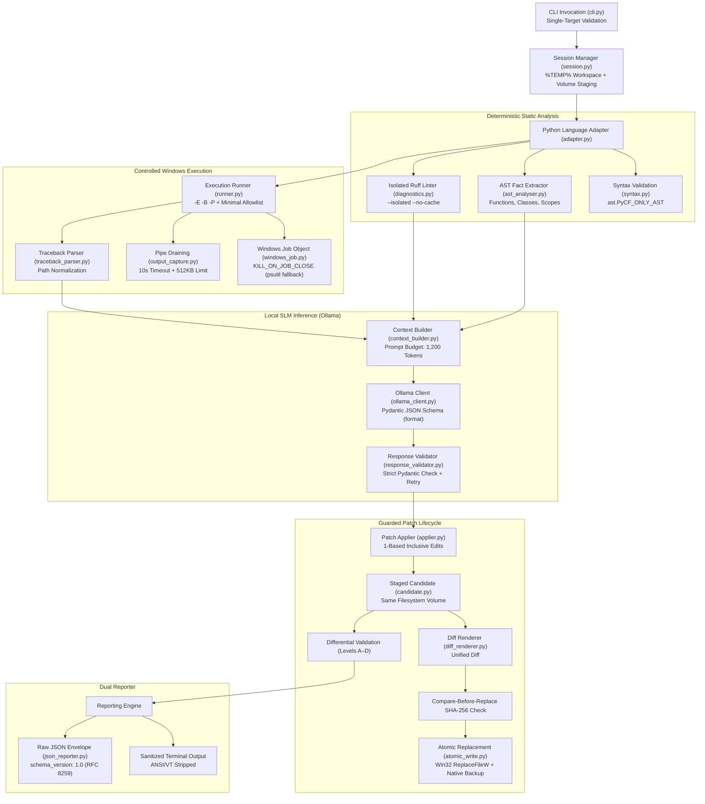
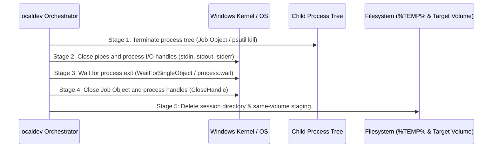

# Architecture Blueprint: localdev

> **Personal Portfolio Project Scope:**
> `localdev` is a personal portfolio project demonstrating high engineering rigor, clean Windows systems integration, deterministic static analysis, and reproducible local AI agent orchestration. It is **not intended to be production-grade infrastructure** or enterprise multi-tenant software.
>
> **Supported Platform:** **Windows 11 x64 only**. All other operating systems and legacy Windows releases are explicitly unsupported.

---

## 1. System Architecture and Component Flow

`localdev` is architected around the principle of **deterministic primacy**: deterministic tools (Python AST parser, compiler flags, isolated Ruff diagnostics, controlled runtime execution) form the ground truth; the local SLM is strictly restricted to explaining verified evidence and proposing structured candidate edits.



---

## 2. Core Delivery Principles

1. **Deterministic Primacy:** Facts originate from deterministic tools (Python AST, compiler flags, isolated Ruff diagnostics, controlled runtime execution); the local SLM is strictly restricted to explaining verified evidence and proposing structured edits.
2. **Strict Single Source Target:** Exactly one Python source file is inspected, analyzed, diagnosed, patched, and validated per command. Secondary data inputs (e.g., `--input` JSON file for profiling or `--expected-stdout` strings for validation) provide execution or assertion data and do not act as additional source targets.
3. **No Automatic Discovery:** No sibling files, local packages, test suites, or Git history are automatically discovered, crawled, or inspected.
4. **No Autonomous Execution or Mutation:** Model output never directly executes shell commands or writes directly to source files.
5. **Guarded Patch Lifecycle:** Edits are schema-validated, applied to an isolated candidate staged on the target's volume, differentially validated, displayed as unified diffs, confirmed by the user (or authorized via noninteractive `--apply`), checked against pre-edit SHA-256 hashes, and replaced atomically via Win32 `ReplaceFileW`.
6. **Execution Boundary for Trusted Code:** Subprocesses run trusted code only under operational limits (timeouts, output byte caps, Job Objects); operational limits are not a security sandbox.
7. **Empirical Validation Levels:** Clear hierarchy: Level A (static validity), Level B (failure reproduction removed), Level C (clean execution exit 0), Level D (behavioral oracle satisfied).
8. **Formal Complexity Contract:** Static complexity reports separate time, auxiliary space, and output space under a strict `conservative + assumption-linked + source-linked + abstention-first` contract based on CPython runtime semantics, explicitly differentiating amortized and expected/average complexities from worst-case bounds.
9. **Separated Memory Profiling:** Hot-process profiling separates import-time metrics, function invocation latency, peak tracemalloc-tracked Python memory allocations, and worker process RSS from external Ollama service residency.
10. **Honest Limitations and Safe Abstention:** When static facts, runtime signatures, complexity bounds, or model responses cannot be established with technical certainty, the application emits an explicit limitation or abstains rather than inventing answers.
11. **Output Integrity:** Terminal output is sanitized against ANSI/VT escape sequences, while machine-readable JSON preserves raw bytes.

---

## 3. Session Lifecycle and 5-Stage Cleanup Sequence

To prevent Windows file sharing violations (`ERROR_SHARING_VIOLATION` / `PermissionError`) caused by processes or open handles locking temporary files, `localdev` enforces a strict 5-stage cleanup sequence:



1. **Stage 1 — Terminate Target Process Tree:** Send termination request to child processes via Windows Job Object (`TerminateJobObject`) or recursive `psutil` termination (`terminate()` followed by `kill()`).
2. **Stage 2 — Close Pipes and Handles:** Close open subprocess pipes (`stdin`, `stdout`, `stderr`) and file descriptors in the parent process.
3. **Stage 3 — Wait for Process Exit:** Block until all descendant processes have completely exited (`process.wait(timeout=5)` / `WaitForSingleObject`).
4. **Stage 4 — Close Job Object / Process Handles:** Explicitly invoke Win32 `CloseHandle` on the Job Object and child process handles.
5. **Stage 5 — Delete Directories:** Safely delete `%TEMP%\localdev\session_<id>` and any same-volume temporary staging directories (`<target_drive>:\.localdev_staging\...`). Aborts if the `.localdev_session` marker is absent.

---

## 4. Hardware Budget and Separated Memory Architecture

The target evaluation environment is a Windows 11 x64 laptop with **8 GB RAM**. System memory is strictly partitioned to prevent out-of-memory (OOM) conditions:

```text
Total System RAM: 8 GB
┌────────────────────────────────────────────────────────┐
│ Windows 11 OS Baseline & Background Services: ~3.0 GB  │
├────────────────────────────────────────────────────────┤
│ Ollama Service + Quantized SLM (Q4_K_M):      ~2.2 GB  │
│   (Unloaded via keep_alive: 0 prior to profiling)      │
├────────────────────────────────────────────────────────┤
│ localdev CLI + Worker Process Tree:           ~0.5 GB  │
│   - Python Heap (tracemalloc tracked):        ~50 MB   │
│   - Worker Process RSS (psutil tracked):      ~150 MB  │
├────────────────────────────────────────────────────────┤
│ Free System Headroom / Buffers:               ~2.3 GB  │
└────────────────────────────────────────────────────────┘
```

### Memory Accounting Dimensions
`localdev` never conflates distinct memory metrics. Reports explicitly distinguish:
1. **Target Python Process Tree RSS:** Total resident working set of the target script and child processes, tracked via `psutil`.
2. **Tracemalloc Heap Allocations:** Pure Python object allocations allocated by CPython's allocator, isolated from interpreter binary footprint.
3. **Job Object Limits:** Hard limits configured on the Windows Job Object.
4. **External Ollama Residency:** Memory held by the external Ollama daemon and loaded model weights.
5. **System Committed RAM:** Global system-wide memory commit state.

---

## 5. Token Context Budgeting and Ollama Structured Output

Inference uses a local Ollama HTTP endpoint (`http://127.0.0.1:11434`). The context window is partitioned with non-negotiable hard boundaries:

| Partition | Tokens | Description |
|---|---|---|
| **Context Window (`num_ctx`)** | **2,048** | Hard upper ceiling passed to Ollama. |
| **Prompt Budget** | **1,200** | Maximum tokens reserved for system prompt, source excerpts, AST facts, and diagnostics. |
| **Output Budget (`num_predict`)** | **600** | Maximum tokens allowed for model generation. |
| **Application Safety Margin** | **248** | Reserved for prompt framing overhead, JSON schema definitions, and tokenization uncertainty. |

$$\text{Prompt Budget (1,200)} + \text{Output Budget (600)} + \text{Safety Margin (248)} = \text{Context Window (2,048)}$$

### Grammar-Constrained Token Generation
- Ollama requests pass a Pydantic-generated JSON Schema object via `format: Model.model_json_schema()`.
- Schemas are kept intentionally simple (primitives, arrays, enums, objects) to ensure compatibility with small local models (1.5B–3B).
- Model output is validated post-generation using Pydantic. Malformed outputs trigger a single structured retry before abstention.

---

## 6. Empirical Validation Levels

Patch validation evaluates the candidate source against four distinct empirical tiers:

| Level | Name | Criteria | Proof of Correctness? |
|---|---|---|---|
| **Level A** | Static Validity | Candidate parses cleanly (`ast.PyCF_ONLY_AST`) and introduces zero new syntax errors or Ruff diagnostics. If the baseline target had a static diagnostic, that diagnostic is eliminated (runtime-only fixes pass Level A without needing a Ruff finding to remove). | No (static only) |
| **Level B** | Failure Reproduction Removed | Under identical execution conditions, the original runtime exception signature `(exception_type, message, file, line)` is **no longer observed**. | **NO.** (Replacing an `IndexError` with a `TypeError` satisfies Level B but fails Level C). |
| **Level C** | Clean Execution | The candidate script executes under controlled runtime limits and exits successfully with code `0`. | Weak (proves clean run, not logic) |
| **Level D** | Behavioral Correctness | Candidate satisfies explicit user-supplied behavioural assertions (`--expected-stdout`, `--expected-exit`). Cannot pass without an explicit user oracle. | Strong (oracle-verified) |

---

## 7. Static Complexity Contract

Complexity analysis estimates asymptotic upper bounds grounded in **CPython runtime semantics**:
- **Closed Vocabulary:** Results are strictly confined to:
  `O(1)`, `O(log n)`, `O(n)`, `O(n log n)`, `O(n²)`, `O(n³)`, `O(nm)`, `O(2^n)`, or `UNKNOWN`.
- **CPython Operation Costs:** Differentiates amortized costs (e.g., `list.append()`) and expected/average costs (e.g., dict lookup) from worst-case bounds.
- **Space Dimensions Separated:**
  - **Auxiliary Space:** Transient intermediate memory allocated during execution (stack frames, temporary collections, recursion depth).
  - **Output Space:** Memory escaping as returned structures.
- **Mandatory Abstention:** If execution contains unknown function calls, dynamic loop bounds, non-linear recursion, or external library calls, `localdev` immediately emits `UNKNOWN` with an explicit abstention reason code (`UNKNOWN_CALL`, `DYNAMIC_BOUNDS`, `DYNAMIC_RECURSION`, `EXTERNAL_DEPENDENCY`, `UNSUPPORTED_SYNTAX`).

