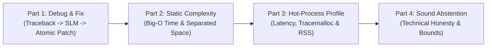

# Demonstration & Operations Guide: localdev

> [!IMPORTANT]
> **Project Scope & System Requirements:**
> `localdev` is a personal portfolio project demonstrating high engineering rigor, clean native Windows systems integration, deterministic static analysis, and reproducible local SLM orchestration.
>
> **Supported Platform:** Supported exclusively on **Windows 11 x64 only**.

---

## 1. Demonstration Overview & Architecture Highlights

This guide provides a structured, four-part operations walkthrough designed to showcase the complete capabilities, deterministic primacy, and safety boundaries of `localdev`:



### Core Architecture Highlights Demonstrated
1. **Deterministic Primacy:** Deterministic tools (AST parser, Ruff linter, runtime execution, tracemalloc) establish ground truth; the local SLM is strictly restricted to explaining verified evidence and proposing structured candidate line edits.
2. **Strict Single-Target Scope:** Exactly one Python source file is inspected, executed, analyzed, or patched. Surrounding files and Git repositories are never crawled or mutated.
3. **Controlled Windows Subprocess Execution:** Target code executes under `python.exe -E -B -P`, an 8-variable OS environment allowlist, user invocation `cwd`, and Windows Job Object containment (`KILL_ON_JOB_CLOSE`).
4. **Guarded Patch Lifecycle:** Edits are schema-validated, applied to an isolated candidate staged on the target's volume, validated across empirical Levels A–D, and swapped atomically via Win32 `ReplaceFileW` with native `.bak` backup and SHA-256 compare-before-replace protection.
5. **Separated Memory Metrics:** Hot-process profiling separates import duration, invocation latency, peak tracemalloc-tracked Python heap allocations, and external worker process tree RSS from external Ollama daemon memory.

---

## 2. Environment Verification & Pre-Flight Checks

Before starting the demonstration, verify that the environment prerequisites are met:

```powershell
# 1. Activate project virtual environment
cd d:\Project\Coding_Agent
.\.venv\Scripts\Activate.ps1

# 2. Verify Windows 11 x64 platform and Python 3.12 (or 3.11)
python -c "import sys; print(f'Platform: {sys.platform} | Python: {sys.version}')"

# 3. Verify Ollama local service availability
curl.exe http://127.0.0.1:11434/api/tags

# 4. Verify localdev CLI entry point
localdev --version
```

---

## 3. Part 1: Primary Debug & Fix Workflow

Demonstrates controlled subprocess execution, runtime traceback parsing, evidence-grounded SLM diagnosis, unified diff rendering, empirical validation gates (Levels A–D), and atomic file replacement with native `.bak` backup.

### Scenario Target: `examples/demo.py`
A self-contained script containing an off-by-one loop bug that raises an `IndexError` at runtime.

```python
# examples/demo.py
def process_scores(scores: list[int]) -> int:
    """Calculate the cumulative total of a score sequence.

    Intentional defect: range(1, len(scores) + 1) raises IndexError on the final
    iteration when accessing scores[i].
    """
    total = 0
    for i in range(1, len(scores) + 1):
        total += scores[i]
    return total

def main() -> None:
    data = [10, 20, 30, 40, 50]
    total = process_scores(data)
    print(f"Total Score: {total}")

if __name__ == "__main__":
    main()
```

### Step 1.1: Execute Target under Controlled Runtime (`debug`)

Execute the target in the controlled Windows subprocess runtime to capture the failure:

```powershell
localdev debug examples/demo.py --diagnose
```

#### What `localdev` Does:
1. Validates `examples/demo.py` (single target, within 256 KB, UTF-8 encoded, regular file).
2. Spawns `python.exe -E -B -P examples/demo.py` in a disposable Windows Job Object.
3. Captures non-zero exit code `1` and parses the stderr traceback into a structured `ErrorSignature`:
   - Exception type: `IndexError`
   - Normalized message: `list index out of range`
   - Fault line: Line 8 (`total += scores[i]`)
4. Assembles compact evidence within the 1,200-token prompt budget.
5. Invokes local SLM (`qwen2.5-coder:3b-instruct-q4_K_M`) with JSON Schema constraints to explain the root cause grounded in the traceback evidence.

---

### Step 1.2: Propose and Review Structured Patch (`fix --propose-only`)

Request an evidence-grounded fix and inspect the proposed unified diff and validation results without modifying the disk:

```powershell
localdev fix examples/demo.py --propose-only --expected-stdout-contains "Total Score: 150"
```

#### What `localdev` Does:
1. Runs baseline execution to verify the `IndexError` failure signature.
2. Context builder feeds AST facts and runtime traceback to the local SLM.
3. SLM returns a schema-constrained `EditProposalRecord` proposing:
   - Operation: `replace`
   - Target line: Line 7
   - Expected: `    for i in range(1, len(scores) + 1):`
   - Replacement: `    for i in range(len(scores)):`
4. Applies patch strictly in-memory / temporary candidate on volume.
5. Evaluates empirical Validation Levels:
   - **Level A (Static Validity):** PASS (Clean AST compile, zero new syntax errors, zero Ruff linter warnings).
   - **Level B (Failure Reproduction Removed):** PASS (Original `IndexError` at line 8 is no longer observed).
   - **Level C (Clean Execution):** PASS (Candidate script exits cleanly with exit code `0`).
   - **Level D (Behavioral Correctness):** PASS (Candidate stdout contains `"Total Score: 150"`).
6. Renders sanitized unified diff and validation checklist to the terminal. Target file on disk remains completely untouched.

---

### Step 1.3: Apply Validated Patch Atomically (`fix --apply`)

Authorize the patch to be written to disk:

```powershell
localdev fix examples/demo.py --apply --expected-stdout-contains "Total Score: 150"
```

#### What `localdev` Does:
1. Verifies write authority via `--apply`.
2. Computes target SHA-256 hash and confirms it matches the baseline captured at command start (stale-edit detection).
3. Invokes Win32 `ReplaceFileW` on the same volume.
4. Atomically replaces `examples/demo.py` and creates `examples/demo.py.bak` containing the original buggy source.
5. Re-executes `localdev debug examples/demo.py` to confirm clean exit (code `0`) and output `"Total Score: 150"`.

---

## 4. Part 2: Static Algorithmic Complexity Analysis

Demonstrates static asymptotic time, auxiliary-space, and output-space analysis grounded in CPython runtime semantics with separated memory dimensions.

### Scenario Target: `examples/demo.py::find_target_pairs`

```python
def find_target_pairs(numbers: list[int], target: int = 100) -> list[tuple[int, int]]:
    """Identify all unique pairs of numbers that sum to the target value."""
    pairs: list[tuple[int, int]] = []
    n = len(numbers)
    for i in range(n):
        for j in range(i + 1, n):
            if numbers[i] + numbers[j] == target:
                pairs.append((numbers[i], numbers[j]))
    return pairs
```

### Step 2.1: Run Complexity Analysis (`complexity`)

```powershell
localdev complexity examples/demo.py::find_target_pairs
```

#### What `localdev` Does:
1. Parses the target AST without executing any Python code.
2. Identifies nested iterative loops over `numbers`: outer loop bounds $n$, inner loop bounds $n - i$, yielding $\frac{n(n-1)}{2}$ iterations.
3. Computes asymptotic upper bounds:
   - **Time Complexity:** $O(n^2)$ (nested polynomial loop bound).
   - **Auxiliary Space:** $O(1)$ (temporary loop index variables; stack depth bounded by constant).
   - **Output Space:** $O(n)$ (returned `pairs` list escaping function scope).
4. Links conclusions directly to source code lines and CPython operation cost models.

---

## 5. Part 3: Hot-Process Function Profiling

Demonstrates hot-process profiling in a disposable worker subprocess, separating import latency, execution latency, tracemalloc heap allocations, and external worker process tree RSS.

### Step 3.1: Profile Function with Input Arguments (`profile`)

Supply a JSON input argument file (`examples/demo_input.json`) containing `{"args": [[...]], "kwargs": {"target": 100}}`:

```powershell
# Run hot-process profiling with warm-up and measured iterations
localdev profile examples/demo.py::find_target_pairs --input examples/demo_input.json --warmup 2 --measured 7
```

#### What `localdev` Does:
1. Validates selector syntax (`find_target_pairs`) and input argument JSON schema.
2. Explicitly triggers Ollama model unload (`client.unload_model()`) to reclaim ~2.18 GB of physical RAM.
3. Spawns an isolated worker subprocess under a Windows Job Object.
4. Measures cold module import time.
5. Executes 2 warm-up invocations to eliminate bytecode compilation and small-object caching transients.
6. Starts an external background thread in the parent process sampling worker process tree RSS at 20 ms intervals (50 Hz).
7. Executes 7 measured invocations within the worker with `tracemalloc` active, preserving persistent module state.
8. Reports separated metrics:
   - **Module Import Latency:** ~0.4 ms (one-time cold load).
   - **Invocation Latency:** ~0.01 ms median latency across measured runs.
   - **Python Heap Allocations (`tracemalloc`):** Peak ~0.2 KB tracked object memory.
   - **Worker Process Tree RSS (`psutil`):** ~37 MB working set.
   - **Hot Process Reused:** `True` (all measured runs executed in persistent worker process).

---

## 6. Part 4: Technical Honesty & Sound Abstention

Demonstrates `localdev`'s foundational commitment to technical honesty: when static facts or model evidence cannot be established with mathematical or logical certainty, the agent explicitly abstains rather than hallucinating or guessing.

### Scenario 4.1: Dynamic While-Loop Bounds in Complexity Analysis

```python
# examples/demo.py
def collatz_steps(n: int) -> int:
    """Count the number of steps to reach 1 under the Collatz conjecture."""
    steps = 0
    while n > 1:
        if n % 2 == 0:
            n = n // 2
        else:
            n = 3 * n + 1
        steps += 1
    return steps
```

Execute complexity analysis:
```powershell
localdev complexity examples/demo.py::collatz_steps
```

#### Expected Outcome:
- **Time Complexity:** `UNKNOWN`
- **Abstention Reason:** `DYNAMIC_BOUNDS`
- **Explanation:** Loop termination depends on runtime value mutations governed by the Collatz conjecture, which cannot be statically bounded.
- **Exit Code:** `6` (`EXIT_ABSTENTION`).

---

### Scenario 4.2: Prompt Budget Exceeded Safeguard

When a target file contains vast amounts of evidence or code exceeding the 1,200-token prompt budget, `localdev` prunes lower-priority evidence. If core irreducible context still exceeds the budget, the agent soundly abstains with [`PromptBudgetExceededError`](file:///d:/Project/Coding_Agent/localdev/errors.py) rather than truncating context silently and hallucinating an ungrounded diagnosis.

---

### Scenario 4.3: Ungrounded Model Proposal Rejection

If an SLM response hallucinates evidence citations not present in the verified static facts or runtime traceback (e.g., citing a non-existent line or phantom variable), `ResponseValidator` detects the ungrounded citation, attempts one structured correction retry, and if still ungrounded, emits a structured [`DiagnosisAbstention`](file:///d:/Project/Coding_Agent/localdev/schemas.py#L485) with reason `UNGROUNDED_EVIDENCE`.

---

## 7. Command Cheatsheet & Troubleshooting

| Goal | Command | Key Flags |
|---|---|---|
| Inspect file metadata | `localdev info script.py` | `--json` for machine-readable output |
| Detect Python confidence | `localdev detect script.py` | Validates extension, shebang, AST |
| Static analysis & Ruff | `localdev analyse script.py` | `--diagnose` for SLM review, `--fallback` for 1.5B |
| Controlled debug run | `localdev debug script.py` | `--diagnose`, `--args ...`, `--timeout 10` |
| Propose patch safely | `localdev fix script.py --propose-only` | `--expected-stdout-contains "..."`, `--model ...` |
| Apply validated patch | `localdev fix script.py --apply` | Native `ReplaceFileW` with `.bak` |
| Static Big-O complexity | `localdev complexity script.py::func` | Target entire file or `script.py::func_name` |
| Hot-process profiling | `localdev profile script.py::func` | `--input in.json`, `--warmup 2`, `--measured 7` |

### Troubleshooting Common Issues

1. **Ollama Service Unreachable (`EXIT_INFERENCE_ERROR: 5`):**
   - Ensure Ollama is running: `Get-Process ollama*`.
   - Verify connectivity: `curl.exe http://127.0.0.1:11434/api/tags`.
   - Ensure model is downloaded: `ollama pull qwen2.5-coder:3b-instruct-q4_K_M`.
2. **Stale Edit Detected (`EXIT_TARGET_IO_ERROR: 3`):**
   - The target file was modified externally after the command began. Reload the file and re-run.
3. **Execution Timeout (`EXIT_TIMEOUT_RESOURCE_BREACH: 4`):**
   - The target script exceeded the 10-second limit. Pass `--timeout <seconds>` to extend the limit if expected.
4. **Cross-Volume Staging Error (`EXIT_TARGET_IO_ERROR: 3`):**
   - Target resides on a non-C: volume. Ensure the drive root is writable so `localdev` can establish `.localdev_staging` on the same volume.

