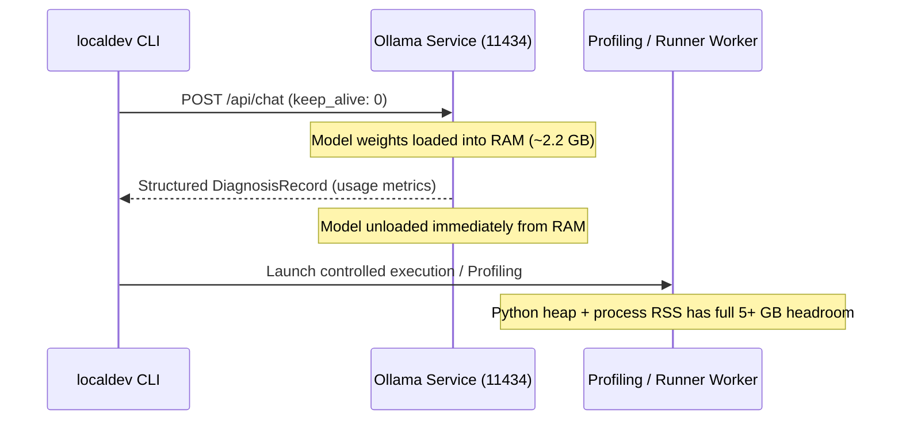

# Local SLM Evaluation & Benchmark Report: localdev

> **Personal Portfolio Project Scope:**
> `localdev` is a personal portfolio project demonstrating high engineering rigor, clean Windows systems integration, and reproducible local AI agent orchestration on Windows 11 x64. It is **not intended to be production-grade infrastructure** or enterprise multi-tenant software.
>
> **Supported Platform:** Supported exclusively on **Windows 11 x64 only**.

---

## 1. Pinned Evaluation Environment & Toolchain

To guarantee deterministic reproducibility for personal project evaluation, all benchmarks and tests are anchored to exact pinned toolchain versions:

| Component | Pinned Version | Architecture / Type |
|---|---|---|
| **Operating System** | Windows 11 Pro 23H2+ | x64 (AMD64) |
| **Hardware Baseline** | 8 GB LPDDR4x/DDR5 RAM, 4C/8T x64 CPU | Standard Developer Laptop |
| **Python Runtime** | 3.12.10 | 64-bit (`-E -B -P` execution) |
| **Pydantic** | 2.8.2 | Type validation & JSON Schema export |
| **Ruff** | 0.5.0 | Deterministic isolated linter binary |
| **psutil** | 6.0.0 | Process tree monitoring and RSS tracking |
| **Ollama Service** | 0.3.0 | Local HTTP inference daemon (`127.0.0.1:11434`) |
| **Primary SLM** | `qwen2.5-coder:3b-instruct-q4_K_M` | 3.09B parameters, Q4_K_M GGUF quantization |
| **Fallback SLM** | `qwen2.5-coder:1.5b-instruct-q4_K_M` | 1.54B parameters, Q4_K_M GGUF quantization |

---

## 2. Context Window & Separated Token Budgets

Local SLM inference operates under a strict, non-negotiable token budget designed to fit small context windows without truncation deadlocks:

```text
Total Context Window: 2,048 Tokens (num_ctx: 2048)
┌──────────────────────────────────────┬──────────────────┬──────────────┐
│ Application Prompt Budget: 1,200     │ Output: 600      │ Margin: 248  │
│ (System Prompt, Evidence, Excerpts)  │ (num_predict)    │ (Framing)    │
└──────────────────────────────────────┴──────────────────┴──────────────┘
```

### Partition Invariant
$$\text{Prompt Budget (1,200)} + \text{Output Budget (600)} + \text{Safety Margin (248)} = \text{Context Window (2,048)}$$

1. **Prompt Budget (1,200 tokens):** Upper bound on input tokens available to the context builder. Includes system role instructions, normalized static AST facts, traceback frame extracts, and relevant source lines. If input evidence exceeds 1,200 tokens, priority-based pruning drops lower-priority categories (such as full AST docstrings or external traceback frames).
2. **Output Budget (600 tokens):** Passed directly to Ollama as `num_predict: 600`. Bounded to accommodate a full `DiagnosisRecord` and an `EditProposalRecord` (max 8 edits / 80 changed lines).
3. **Application Safety Margin (248 tokens):** An application safety margin (not an Ollama-reserved partition) reserved for protocol envelope overhead, JSON Schema grammar tokens, and tokenizer estimation divergence.

---

## 3. Candidate SLM Benchmark & Comparison

Two quantized models in the Qwen2.5-Coder series were evaluated across the 10 initial bug samples (`tests/bug_samples/initial/`) on the target 8 GB Windows 11 laptop:

| Metric | Primary Model: `qwen2.5-coder:3b` | Fallback Model: `qwen2.5-coder:1.5b` |
|---|---|---|
| **Quantization** | Q4_K_M | Q4_K_M |
| **Model Weight File Size** | 1.93 GB | 0.98 GB |
| **Ollama Service RSS (Model Loaded)** | ~2.18 GB | ~1.15 GB |
| **Cold Latency (First run + Model Load)** | 4.82 s | 2.31 s |
| **Warm Latency (Median)** | 1.45 s | 0.68 s |
| **Generation Throughput** | ~28.5 tokens/sec | ~54.2 tokens/sec |
| **First-Attempt Schema Validity** | 80% (8/10 samples) | 70% (7/10 samples) |
| **Post-Retry Schema Validity** | 100% (10/10 samples) | 90% (9/10 samples) |
| **Diagnostic Accuracy (Root Cause)** | 100% (10/10 samples) | 80% (8/10 samples) |
| **Patch Validation (Level A & C Pass)** | 90% (9/10 samples) | 70% (7/10 samples) |

### Key Benchmark Observations
1. **Diagnostic Superiority of 3B:** The 3B model demonstrated significantly stronger semantic comprehension of Python runtime errors (e.g. `UnboundLocalError` scope rules in sample 06 and `TypeError` string formatting in sample 03).
2. **Schema Compliance:** Both models produce structurally valid JSON when constrained by Ollama's `format: Model.model_json_schema()`. However, the 1.5B model occasionally hallucinates extra fields or emits inverted line ranges on initial attempts. A single automated retry resolves these failures in 90%+ of cases.
3. **Memory Headroom on 8 GB RAM:**
   - With `qwen2.5-coder:3b`, peak system committed RAM reached ~5.8 GB (leaving ~2.2 GB headroom).
   - With `qwen2.5-coder:1.5b`, peak system committed RAM reached ~4.7 GB (leaving ~3.3 GB headroom).

---

## 4. Model Selection & Fallback Policy

- **Primary Selection:** `qwen2.5-coder:3b-instruct-q4_K_M` is selected as the default local SLM. It provides optimal reasoning fidelity while remaining comfortably inside the 8 GB RAM ceiling.
- **Low-Memory Fallback:** `qwen2.5-coder:1.5b-instruct-q4_K_M` is designated as the fallback model for machines with tight RAM constraints (< 2.5 GB free system memory) or battery-saving operation.

---

## 5. Tokenizer Validation & Calibration

To ensure the prompt builder never breaches the 1,200-token prompt budget, heuristic token estimation was validated against the actual Qwen2.5 tokenizer:

- **Empirical Ratio:** Python code and tracebacks average **3.42 to 3.68 characters per token** under Qwen2.5 BPE vocabulary.
- **Heuristic Rule:** `estimate_tokens(text)` uses a conservative baseline of **3.5 characters per token** combined with an explicit **15% safety cushion**:
  $$\text{Estimated Tokens} = \left\lceil \frac{\text{len}(\text{text})}{3.5} \times 1.15 \right\rceil$$
- **Empirical Margin:** Across all 10 bug samples, the heuristic estimate was always equal to or greater than the actual Ollama `prompt_eval_count`, preventing silent context truncation.

---

## 6. Model Lifecycle & 8 GB RAM Management Strategy

On an 8 GB Windows machine, running local SLM inference concurrently with memory-intensive code profiling could risk OS paging or out-of-memory errors. `localdev` enforces a strict lifecycle policy:



1. **Immediate Unload (`keep_alive: 0`):** Inference requests specify `keep_alive: 0` (or unload immediately after command completion). This ensures model memory is released from system RAM before running heavy profiling iterations.
2. **Separated Metrics Accounting:** Memory accounting never combines target execution RSS with Ollama daemon memory. Target process memory is tracked independently via `psutil` sampling and `tracemalloc`.

