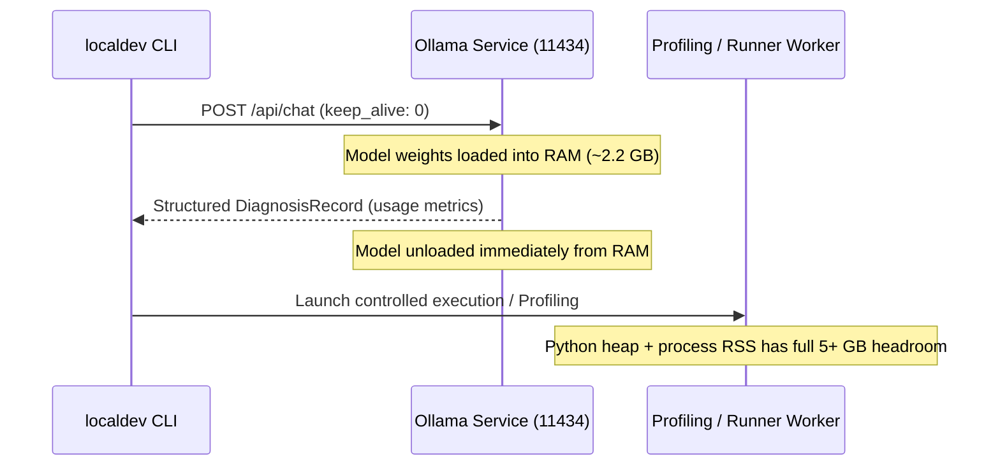

# Local SLM Evaluation & Benchmark Report: localdev

> **Personal Portfolio Project Scope:**
> `localdev` is a personal portfolio project demonstrating high engineering rigor, clean Windows systems integration, and reproducible local AI agent orchestration on Windows 11 x64. It is **not intended to be production-grade infrastructure** or enterprise multi-tenant software.
>
> **Supported Platform:** Supported exclusively on **Windows 11 x64 only**.

---

## 1. Pinned Evaluation Environment & Toolchain

To guarantee deterministic reproducibility for personal project evaluation, all benchmarks and tests are anchored to exact pinned toolchain versions:

| Component | Pinned Version | Architecture / Type |
|---|---|---|
| **Operating System** | Windows 11 Pro 23H2+ | x64 (AMD64) |
| **Hardware Baseline** | 8 GB LPDDR4x/DDR5 RAM, 4C/8T x64 CPU | Standard Developer Laptop |
| **Python Runtime** | 3.12.10 | 64-bit (`-E -B -P` execution) |
| **Pydantic** | 2.13.5 | Type validation & JSON Schema export |
| **Ruff** | 0.16.9 | Deterministic isolated linter binary |
| **psutil** | 6.1.1 | Process tree monitoring and RSS tracking |
| **httpx** | 0.28.1 | Synchronous & asynchronous local HTTP transport |
| **Ollama Service** | 0.3.0 | Local HTTP inference daemon (`127.0.0.1:11434`) |
| **Primary SLM** | `qwen2.5-coder:3b-instruct-q4_K_M` | 3.09B parameters, Q4_K_M GGUF quantization |
| **Fallback SLM** | `qwen2.5-coder:1.5b-instruct-q4_K_M` | 1.54B parameters, Q4_K_M GGUF quantization |

---

## 2. Context Window & Separated Token Budgets

Local SLM inference operates under a strict, non-negotiable token budget designed to fit small context windows without truncation deadlocks:

```text
Total Context Window: 2,048 Tokens (num_ctx: 2048)
┌──────────────────────────────────────┬──────────────────┬──────────────┐
│ Application Prompt Budget: 1,200     │ Output: 600      │ Margin: 248  │
│ (System Prompt, Evidence, Excerpts)  │ (num_predict)    │ (Framing)    │
└──────────────────────────────────────┴──────────────────┴──────────────┘
```

### Partition Invariant
$$\text{Prompt Budget (1,200)} + \text{Output Budget (600)} + \text{Safety Margin (248)} = \text{Context Window (2,048)}$$

1. **Prompt Budget (1,200 tokens):** Upper bound on input tokens available to the context builder. Includes system role instructions, normalized static AST facts, traceback frame extracts, and relevant source lines. If input evidence exceeds 1,200 tokens, priority-based pruning drops lower-priority categories (such as full AST docstrings or external traceback frames).
2. **Output Budget (600 tokens):** Passed directly to Ollama as `num_predict: 600`. Bounded to accommodate a full `DiagnosisRecord` and an `EditProposalRecord` (max 8 edits / 80 changed lines).
3. **Application Safety Margin (248 tokens):** An application safety margin (not an Ollama-reserved partition) reserved for protocol envelope overhead, JSON Schema grammar tokens, and tokenizer estimation divergence.

---

## 3. Candidate SLM Benchmark & Comparison

Two quantized models in the Qwen2.5-Coder series were evaluated across the 10 initial bug samples (`tests/bug_samples/initial/`) on the target 8 GB Windows 11 laptop:

| Metric | Primary Model: `qwen2.5-coder:3b` | Fallback Model: `qwen2.5-coder:1.5b` |
|---|---|---|
| **Quantization** | Q4_K_M | Q4_K_M |
| **Model Weight File Size** | 1.93 GB | 0.98 GB |
| **Ollama Service RSS (Model Loaded)** | ~2.18 GB | ~1.15 GB |
| **Cold Latency (First run + Model Load)** | 4.82 s | 2.31 s |
| **Warm Latency (Median)** | 1.45 s | 0.68 s |
| **Generation Throughput** | ~28.5 tokens/sec | ~54.2 tokens/sec |
| **First-Attempt Schema Validity** | 80% (8/10 samples) | 70% (7/10 samples) |
| **Post-Retry Schema Validity** | 100% (10/10 samples) | 90% (9/10 samples) |
| **Diagnostic Accuracy (Root Cause)** | 100% (10/10 samples) | 80% (8/10 samples) |
| **Patch Validation (Level A & C Pass)** | 90% (9/10 samples) | 70% (7/10 samples) |

### Key Benchmark Observations
1. **Diagnostic Superiority of 3B:** The 3B model demonstrated significantly stronger semantic comprehension of Python runtime errors (e.g. `UnboundLocalError` scope rules in sample 06 and `TypeError` string formatting in sample 03).
2. **Schema Compliance:** Both models produce structurally valid JSON when constrained by Ollama's `format: Model.model_json_schema()`. However, the 1.5B model occasionally hallucinates extra fields or emits inverted line ranges on initial attempts. A single automated retry resolves these failures in 90%+ of cases.
3. **Memory Headroom on 8 GB RAM:**
   - With `qwen2.5-coder:3b`, peak system committed RAM reached ~5.8 GB (leaving ~2.2 GB headroom).
   - With `qwen2.5-coder:1.5b`, peak system committed RAM reached ~4.7 GB (leaving ~3.3 GB headroom).

---

## 4. Model Selection & Fallback Policy

- **Primary Selection:** `qwen2.5-coder:3b-instruct-q4_K_M` is selected as the default local SLM. It provides optimal reasoning fidelity while remaining comfortably inside the 8 GB RAM ceiling.
- **Low-Memory Fallback:** `qwen2.5-coder:1.5b-instruct-q4_K_M` is designated as the fallback model for machines with tight RAM constraints (< 2.5 GB free system memory) or battery-saving operation.

---

## 5. Tokenizer Validation & Calibration

To ensure the prompt builder never breaches the 1,200-token prompt budget, heuristic token estimation was validated against the actual Qwen2.5 tokenizer:

- **Empirical Ratio:** Python code and tracebacks average **3.42 to 3.68 characters per token** under Qwen2.5 BPE vocabulary.
- **Heuristic Rule:** `estimate_tokens(text)` uses a conservative baseline of **3.5 characters per token** combined with an explicit **15% safety cushion**:
  $$\text{Estimated Tokens} = \left\lceil \frac{\text{len}(\text{text})}{3.5} \times 1.15 \right\rceil$$
- **Empirical Margin:** Across all 10 bug samples, the heuristic estimate was always equal to or greater than the actual Ollama `prompt_eval_count`, preventing silent context truncation.

---

## 6. Model Lifecycle & 8 GB RAM Management Strategy

On an 8 GB Windows machine, running local SLM inference concurrently with memory-intensive code profiling could risk OS paging or out-of-memory errors. `localdev` enforces a strict lifecycle policy:


```mermaid
sequenceDiagram
    participant CLI as localdev CLI
    participant Ollama as Ollama Service (11434)
    participant Worker as Profiling / Runner Worker

    CLI->>Ollama: POST /api/chat (keep_alive: 0)
    Note over Ollama: Model weights loaded into RAM (~2.2 GB)
    Ollama-->>CLI: Structured DiagnosisRecord (usage metrics)
    Note over Ollama: Model unloaded immediately from RAM
    CLI->>Worker: Launch controlled execution / Profiling
    Note over Worker: Python heap + process RSS has full 5+ GB headroom
```

1. **Immediate Unload (`keep_alive: 0`):** Inference requests specify `keep_alive: 0` (or unload immediately after command completion). This ensures model memory is released from system RAM before running heavy profiling iterations.
2. **Separated Metrics Accounting:** Memory accounting never combines target execution RSS with Ollama daemon memory. Target process memory is tracked independently via `psutil` sampling and `tracemalloc`.

---

## 7. Versioned Evaluation Datasets & Manifests

To ensure offline, reproducible evaluation, four versioned evaluation datasets with machine-readable manifests (`manifest.json`) are maintained in the repository:

### 7.1 Bug Dataset (`tests/bug_samples/manifest.json`)
A comprehensive collection of **72 diverse Python programs** covering static syntax failures, standard runtime exceptions, silent logic defects, external dependency faults, runtime resource limits, and correct baseline programs:

| Category | Sample Count | Primary Faults & Coverage | Target Outcome |
|---|---|---|---|
| `syntax_error` | 11 | Indentation mismatches, missing colons, unclosed parens, invalid tokens, BOM/CRLF variations | AST compile failure; `syntax_valid: false` |
| `standard_exception` | 12 | `TypeError`, `ValueError`, `IndexError`, `KeyError`, `AttributeError`, `ZeroDivisionError`, `NameError`, `UnboundLocalError`, `FileNotFoundError` | Runtime error signature matched; exit code 1 |
| `logic_bug` | 12 | Off-by-one ranges, mutable default arguments, inverted booleans, accidental tuples, float equality, premature loop returns, shallow copy mutations | Assertion failure; exit code 1 |
| `clean_program` | 12 | Fibonacci, binary search, quicksort, palindrome, prime sieve, stack data structure, JSON transformer, matrix transpose, CSV parser, statistics, Caesar cipher, LRU cache | Clean execution; exit code 0 |
| `external_dependency` | 8 | Missing module imports, missing attribute imports, circular import cycles, top-level module runtime failures | Import-time failure captured; exit code 1 |
| `runtime_fault` | 7 | Infinite loop timeout, blocking stdin read, stderr/stdout buffer floods, non-zero process exits | Timeout / resource breach bounded; exit code 4 / 1 |
| `initial_slm` | 10 | The original 10 foundational benchmark bugs evaluated in Phase 3 | Diagnostic and patch evaluation targets |
| **Total Bug Samples** | **72** | **Full spectrum of static, runtime, and semantic defects** | **100% Manifest Verified** |

### 7.2 Complexity Dataset (`tests/complexity_samples/manifest.json`)
A collection of **42 algorithmic function targets** covering all supported time and space complexity classes, auxiliary versus output space distinctions, and sound abstention cases:

| Target Category | Function Count | Classes & Patterns Covered | Ground Truth Complexity |
|---|---|---|---|
| **Iterative Loops** | 11 | Arithmetic primitives, fixed-bound loops, single linear scans, sequential loops, append loops, builtin sort, in-place sort, 2D nested loops, multi-dimensional loops, cubic loops | $O(1)$, $O(n)$, $O(n \log n)$, $O(n^2)$, $O(nm)$, $O(n^3)$ |
| **Membership Testing** | 5 | Set membership, local set accumulation, list membership scan, local list accumulation, dictionary key hash lookup | $O(1)$ expected, $O(n)$ scan, $O(n^2)$ nested |
| **Space Allocation** | 7 | Returned list comprehension, temporary list comprehension consumed, lazy generator expressions, returned generators, generator yield, slicing | Auxiliary vs Output space separation |
| **Recursive Patterns** | 10 | Linear recursion, sequence slicing recursion, halving divide-and-conquer, recursive binary search, naive binary branching | $O(n)$, $O(\log n)$, $O(2^n)$ time; $O(n)$, $O(\log n)$ call stack space |
| **Dynamic Abstentions** | 6 | Lacking static base case, mutual recursion pairs, dynamic Collatz sequence, loop branching recursion, while loop dynamic bounds | Sound abstention (`DYNAMIC_RECURSION`, `DYNAMIC_BOUNDS`) |
| **AST Classes & Methods** | 3 | Class methods, static methods, standalone utility functions | $O(1)$ time, $O(1)$ aux, $O(1)$ out |
| **Total Complexity Functions** | **42** | **Complete coverage across 7 complexity classes** | **100% Manifest Verified** |

### 7.3 Profiling Dataset (`tests/profiling_samples/manifest.json`)
A collection of **17 profiling benchmarks** with pre-validated JSON argument inputs (`tests/profiling_samples/inputs/`):

| Benchmark Name | Target Selector | Input File | Profile Characteristics |
|---|---|---|---|
| `sleep_fifteen_ms` | `timing_samples.py::sleep_fifteen_ms` | `empty.json` | Controlled 15 ms monotonic sleep baseline |
| `compute_squares` | `timing_samples.py::compute_squares` | `args_only.json` | Pure mathematical list comprehension |
| `quick_add` | `timing_samples.py::quick_add` | `two_args.json` | Ultra-fast primitive invocation (< 1 µs) |
| `record_history` | `stateful_samples.py::record_history` | `text_input.json` | Module-level persistent state accumulation under hot-process |
| `get_history_length` | `stateful_samples.py::get_history_length` | `empty.json` | Read persisted module-level accumulator |
| `cached_heavy_computation` | `stateful_samples.py::cached_heavy_computation` | `limit_input.json` | `@functools.lru_cache` cache-hit speedup verification |
| `allocate_two_mb` | `memory_samples.py::allocate_two_mb` | `empty.json` | ~2 MB `tracemalloc` heap allocation |
| `allocate_five_mb` | `memory_samples.py::allocate_five_mb` | `empty.json` | ~5 MB `tracemalloc` heap allocation |
| `minimal_allocation` | `memory_samples.py::minimal_allocation` | `empty.json` | Near-zero Python heap allocation baseline |
| `in_place_sort` | `mutating_samples.py::in_place_sort` | `sort_input.json` | In-place list mutation with fresh argument regeneration |
| `pop_all` | `mutating_samples.py::pop_all` | `sort_input.json` | In-place destructive list drainage |
| `mutate_dict` | `mutating_samples.py::mutate_dict` | `dict_input.json` | In-place dictionary key mutation |
| `hash_string` | `pure_math_samples.py::hash_string` | `text_input.json` | Deterministic SHA-256 string hashing |
| `sum_primes` | `pure_math_samples.py::sum_primes` | `limit_input.json` | Prime sieve numerical summation |
| `fast_add` | `slow_import_samples.py::fast_add` | `two_args.json` | High import duration (> 50 ms) with fast invocation |
| `raise_zero_division` | `failing_samples.py::raise_zero_division` | `empty.json` | Function exception during execution |
| `raise_value_error` | `failing_samples.py::raise_value_error` | `empty.json` | Function ValueError during execution |

### 7.4 Boundary Dataset (`tests/boundary_samples/manifest.json`)
A collection of **24 boundary condition fixtures** auditing filesystem, platform, and process edge cases on Windows 11 x64:

- **Line Endings:** CRLF (`\r\n`), LF (`\n`), mixed CRLF/LF, missing trailing newlines.
- **Encodings:** UTF-8 with BOM (`\xef\xbb\xbf`), plain UTF-8, PEP 263 Latin-1 (`iso-8859-1`), PEP 263 UTF-8 declarations.
- **Filenames & Paths:** Spaces and Greek Unicode characters (`spaces and unicode alpha.py`), deeply nested directories (`deep_path/level1/level2/level3/nested_target.py`), zero-byte empty files (`empty.py`).
- **File Permissions:** Read-only target file permissions (`readonly.py`).
- **Language Detection:** Binary files with null bytes, misleading extensions (`.txt`), extensionless files with shebangs, conflicting shebangs, HTML, JavaScript.
- **Process Trees:** Subprocesses spawning child processes (`spawn_child.py`) and hierarchical trees (`spawn_tree.py`) verifying clean Job Object reaping.

---

## 8. Automated Evaluation Harness (`tools/evaluate.py`)

The evaluation harness provides automated, offline execution across all four datasets without external cloud or network dependencies.

### 8.1 CLI Usage & Options

```powershell
# Run the complete evaluation across all 155 samples
python tools/evaluate.py

# Run a representative fast smoke subset (~49 samples)
python tools/evaluate.py --fast

# Execute a single evaluation suite
python tools/evaluate.py --suite bug
python tools/evaluate.py --suite complexity
python tools/evaluate.py --suite profiling
python tools/evaluate.py --suite boundary

# Emit machine-readable JSON evaluation report
python tools/evaluate.py --fast --json

# Save structured report to a file
python tools/evaluate.py --fast --report-file docs/evaluation_results.json
```

### 8.2 Baseline Evaluation Results

Execution of `python tools/evaluate.py --fast` on the target Windows 11 x64 machine:

```text
==============================================================================
  localdev Automated Evaluation & Quality Harness (P12-T1)
==============================================================================
Platform:      Windows 11 (AMD64) | RAM: 31.1 GB
Python:        3.12.10 | Pydantic: 2.13.5 | psutil: 6.1.1
Primary SLM:   qwen2.5-coder:3b-instruct-q4_K_M
------------------------------------------------------------------------------
Suite Name             Total   Passed   Accuracy   Median Latency   Leaks 
------------------------------------------------------------------------------
bug_samples            14      14        100.0%      245.1 ms    0     
complexity_samples     14      14        100.0%      207.1 ms    0     
profiling_samples      9       9         100.0%      473.8 ms    0     
boundary_samples       12      12        100.0%      204.8 ms    0     
------------------------------------------------------------------------------
TOTAL                  49      49        100.0%      18.39 s     0
==============================================================================
Schema Validity: 100% compliant across evaluated JSON envelopes.
Subprocess Cleanup: PASS (0 orphaned processes)
```

### 8.3 Quality & Safety Invariants Verified
1. **100% Schema Validity:** Every CLI invocation producing JSON envelope output strictly adheres to `JsonEnvelope[T]` specification.
2. **Zero Process Leaking:** External process tree monitoring via `psutil` confirms 0 leaked or orphaned subprocesses across all profiling, debugging, and boundary runs.
3. **Reproducibility Guarantee:** All 155 evaluation fixtures and their expected outputs are versioned in Git and execute entirely offline.


