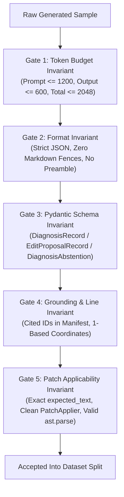
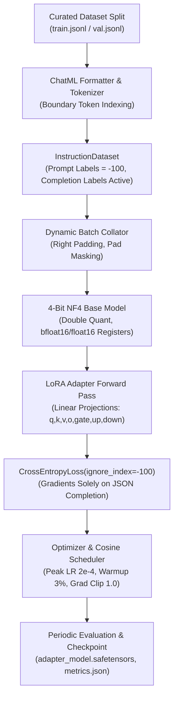

# Domain-Specific SLM Fine-Tuning: Dataset Curation & Verification

> **Personal Portfolio Project Scope:**
> `localdev` is a personal portfolio project demonstrating high engineering rigor, clean Windows systems integration, and reproducible local AI agent orchestration on Windows 11 x64. It is **not intended to be production-grade infrastructure** or enterprise multi-tenant software.
>
> **Supported Platform:** Supported exclusively on **Windows 11 x64 only**.

---

## 1. Overview & Objective (Phase 13)

Phase 13 establishes an offline fine-tuning workflow to adapt compact Small Language Models (SLMs)—specifically `Qwen/Qwen2.5-Coder-3B-Instruct` and `Qwen/Qwen2.5-Coder-1.5B-Instruct`—to the exact schema and grounding contracts of the `localdev` agent architecture.

While generic instruction-tuned models perform reasonably well on conversational code tasks, standard base SLMs frequently produce:
1. **Markdown wrapping violations:** Emitting conversational commentary or enclosing JSON inside ` ```json ... ``` ` code fences instead of raw JSON.
2. **Hallucinated evidence:** Inventing arbitrary file paths, imaginary line numbers, or uncited error causes rather than strictly referencing verified static and runtime evidence IDs.
3. **Patch indexing shifts:** Emitting 0-based lines, non-inclusive coordinates, or mismatched `expected_text` that fails deterministic patch application.
4. **Failure to abstain:** Guessing repairs on ungrounded or clean targets where an explicit technical abstention (`DiagnosisAbstention`) is required.

**Phase 13 Task P13-T1** solves this by establishing a deterministic dataset curation, multi-stage validation, and token-filtering pipeline. It produces at least 3,000 verified instruction-tuning pairs partitioned into reproducible 80/10/10 train/val/test splits.

---

## 2. Token Budget Partition & Invariants

Local SLM inference operates strictly within a **2,048-token context window**. To avoid truncation deadlocks and preserve a deterministic token budget, every instruction pair complies with the following invariant:

```text
Total Context Window: 2,048 Tokens
┌──────────────────────────────────────┬──────────────────┬──────────────┐
│ Prompt Budget: <= 1,200 Tokens       │ Output: <= 600   │ Margin >= 248│
│ (System Prompt, Evidence, Excerpts)  │ (JSON Payload)   │ (Framing)    │
└──────────────────────────────────────┴──────────────────┴──────────────┘
```

$$\text{Prompt Tokens } (\le 1,200) + \text{Completion Tokens } (\le 600) \le \text{Context Window } (2,048)$$

### Exact Qwen2.5 Tokenization
Token lengths are computed directly using the official `Qwen2.5-Coder` BPE vocabulary (151,665 tokens). The tokenizer is saved locally to:
```text
tools/finetune/qwen_tokenizer.json
```
This ensures 100% offline, zero-network token verification without relying on external Hugging Face Hub connections.

---

## 3. Instruction Dataset Architecture & Schemas

The dataset encompasses three complementary task types:

### A. Evidence-Grounded Diagnosis (`DiagnosisRecord`)
- **System Prompt:** `DIAGNOSIS_SYSTEM_PROMPT` (from `localdev.inference.prompts`).
- **Prompt Content:** Target file header, available evidence manifest (`[runtime:...]`, `[traceback:...]`, `[ast:...]`, `[ruff:...]`, `[syntax:...]`), primary failure signature, and source code excerpt enclosed within `<<<BEGIN UNTRUSTED TARGET SOURCE CODE>>>` markers.
- **Completion Schema:** Raw JSON conforming to `DiagnosisRecord`:
  ```json
  {
    "bug_description": "Concise description of the diagnosed defect.",
    "root_cause": "Explanation of underlying cause identified from evidence.",
    "confidence": "HIGH",
    "cited_evidence_ids": [
      "runtime:ZeroDivisionError",
      "traceback:line_8"
    ],
    "rationale": "Logical reasoning linking cited evidence to proposed cause."
  }
  ```
- **Grounding Invariant:** Every ID in `cited_evidence_ids` **must** exist in the prompt's `Available Evidence Manifest`. Hallucinated or non-existent IDs are strictly rejected by the validator.

### B. Surgical Edit Proposals (`EditProposalRecord`)
- **System Prompt:** `EDIT_PROPOSAL_SYSTEM_PROMPT` (from `localdev.inference.prompts`).
- **Prompt Content:** Target file header, diagnosed fault context, runtime failure evidence, and target source excerpt with 1-based line numbers.
- **Completion Schema:** Raw JSON conforming to `EditProposalRecord`:
  ```json
  {
    "target_file": "finance_transaction.py",
    "edits": [
      {
        "operation": "replace",
        "start_line": 8,
        "end_line": 8,
        "expected_text": "    return total / len(items)",
        "replacement_text": "    if not items:\n        return 0.0\n    return total / len(items)"
      }
    ],
    "explanation": "Add empty list check returning 0.0 before performing division."
  }
  ```
- **Patch Applicability Invariant:** 
  1. `start_line` and `end_line` are 1-based and inclusive.
  2. `expected_text` must match the exact source lines (including whitespace).
  3. Edits must be strictly ordered by line number and non-overlapping.
  4. The patch must apply cleanly via `PatchApplier`, and the resulting code must compile cleanly via `ast.parse()`.

### C. Sound Technical Abstentions (`DiagnosisAbstention`)
- **System Prompt:** `DIAGNOSIS_SYSTEM_PROMPT`.
- **Use Cases:** Clean files (exit code 0, clean AST, zero linter diagnostics), external dependency errors outside single-target file boundaries, out-of-bounds line frames, or prompt budget exceeded.
- **Completion Schema:** Raw JSON conforming to `DiagnosisAbstention`:
  ```json
  {
    "target": "finance_clean.py",
    "reason": "UNGROUNDED_EVIDENCE",
    "details": "Clean execution (exit code 0). AST parses cleanly and zero static diagnostics detected.",
    "raw_payload": null,
    "validation_errors": [],
    "retry_attempted": false
  }
  ```

---

## 4. Multi-Stage Automated Validation Pipeline

The pipeline (`tools/finetune/prepare_dataset.py`) validates every generated candidate pair through 5 strict validation gates:



If a candidate fails any gate, it is rejected immediately with a descriptive error.

---

## 5. Dataset Summary & Manifest Statistics

The curated dataset consists of **3,800 total instruction pairs**, serialized to `datasets/finetune/`:

| File | Sample Count | Share | Description |
|---|---|---|---|
| `train.jsonl` | **3,040** | 80.0% | Primary training split for QLoRA fine-tuning |
| `val.jsonl` | **380** | 10.0% | Held-out validation split for loss and schema parse evaluation |
| `test.jsonl` | **380** | 10.0% | Unseen test split for benchmark evaluation |
| `manifest.json` | 1 | — | Comprehensive metadata, token statistics, and verification audit |

### Task Distribution
- **Diagnosis (`DiagnosisRecord`):** 1,558 pairs (41.0%)
- **Edit Proposal (`EditProposalRecord`):** 1,558 pairs (41.0%)
- **Abstention (`DiagnosisAbstention`):** 684 pairs (18.0%)

### Category Coverage
- **Standard Exceptions:** `ZeroDivisionError` (312), `IndexError` (312), `KeyError` (312), `TypeError` (312), `AttributeError` (312), `ValueError` (312), `NameError` (312), `RecursionError` (312)
- **Syntax Diagnostics:** `SyntaxError` / `IndentationError` (310)
- **Logic Bugs:** Accidental tuples, inverted conditionals, mutable defaults, early returns (310)
- **Abstentions:** `clean_code` (171), `external_dependency` (171), `out_of_bounds` (171), `prompt_budget_exceeded` (171)

### Token Statistics (Measured via Qwen2.5 Tokenizer)
- **Prompt Tokens:** Min: 437.0, Mean: 587.2, Max: 705.0 (Budget: $\le 1,200$)
- **Completion Tokens:** Min: 68.0, Mean: 101.0, Max: 141.0 (Budget: $\le 600$)
- **Total Tokens:** Min: 511.0, Mean: 688.2, Max: 827.0 (Budget: $\le 2,048$)
- **Budget Violations:** **0**

---

## 6. Execution & Verification Guide

### Generate the Dataset
To regenerate the dataset deterministically:
```powershell
python tools/finetune/prepare_dataset.py --num-samples 3800 --seed 42
```

### Verify an Existing Dataset
To execute the multi-stage validator across all persisted split files without re-generating:
```powershell
python tools/finetune/prepare_dataset.py --verify-only
```

### Run Unit Tests
To execute the automated unit and regression test suite:
```powershell
python -m pytest tests/unit/test_dataset_preparation.py -v
```

---

---

## 7. QLoRA Training Pipeline & Reproducible Recipe (P13-T2)

Phase 13 Task P13-T2 establishes a scriptable, reproducible QLoRA training pipeline (`tools/finetune/train_qlora.py` and `tools/finetune/config.py`) to fine-tune compact Small Language Models (`Qwen/Qwen2.5-Coder-3B-Instruct` and `Qwen/Qwen2.5-Coder-1.5B-Instruct`) on consumer GPU hardware (< 8–12 GB VRAM).



### A. 4-Bit NF4 Quantization & Memory Footprint

To minimize VRAM consumption without degrading weight representation, the pipeline utilizes **4-bit NormalFloat (NF4)** base model quantization with double quantization:
- **Quantization Data Type:** `nf4` (the information-theoretically optimal quantile distribution for zero-mean normal weights).
- **Double Quantization (`bnb_4bit_use_double_quant=True`):** Quantizes the first-stage quantization constants, saving an additional ~0.4 bits per parameter (~300 MB on a 3B parameter model).
- **Compute Precision (`bnb_4bit_compute_dtype`):** `bfloat16` (or `float16`), dequantizing 4-bit weights into 16-bit registers during matrix multiplications.
- **Gradient Checkpointing:** Recomputes activations during backward passes rather than storing them in VRAM, slashing activation memory by > 65%.

### B. LoRA Parameter Specification & Target Modules

Low-Rank Adaptation (LoRA) injects trainable rank decomposition matrices into the frozen transformer projection layers:

$$W = W_0 + \Delta W = W_0 + \frac{\alpha}{r} (B \times A)$$

Where $A \in \mathbb{R}^{r \times d_{\text{in}}}$ is initialized with a Gaussian distribution, and $B \in \mathbb{R}^{d_{\text{out}} \times r}$ is initialized to zero.

- **Target Modules:** All 7 linear projection layers in attention and MLP blocks:
  - Attention projections: `q_proj`, `k_proj`, `v_proj`, `o_proj`
  - Feed-forward / SwiGLU projections: `gate_proj`, `up_proj`, `down_proj`
- **Rank ($r$):** 32
- **Scaling Factor ($\alpha$):** 64 ($\text{scaling ratio } \alpha / r = 2.0$)
- **Dropout:** 0.05
- **Trainable Parameter Ratio:** < 1.2% of total base model parameters (~36M trainable parameters for 3B base).

### C. Completion-Exclusive Loss Masking Invariant

Standard causal language modeling trains on the joint likelihood of both prompt and completion tokens. For schema-constrained SLMs, this is detrimental: the model wastes parameter capacity memorizing repetitive system prompts, source excerpts, and static evidence.

To enforce deterministic schema adherence, our training pipeline applies **loss masking** exclusively to prompt tokens:

```text
ChatML Sequence Layout:
┌───────────────────────────────────────────────┬───────────────────────────────────────────┐
│ Prompt Tokens (System + Context + User)       │ Completion Tokens (Structured JSON)       │
│ <|im_start|>system...<|im_start|>assistant\n  │ {"bug_description": ...}<|im_end|>\n     │
├───────────────────────────────────────────────┼───────────────────────────────────────────┤
│ Labels: [-100, -100, -100, ..., -100]         │ Labels: [Token_ID_1, Token_ID_2, ..., EOS]│
│ (IGNORED by CrossEntropyLoss)                 │ (ACTIVE GRADIENTS)                        │
└───────────────────────────────────────────────┴───────────────────────────────────────────┘
```

Formally, the token loss is computed via PyTorch's `CrossEntropyLoss(ignore_index=-100)`:

$$\mathcal{L}_{\text{CE}} = - \frac{1}{\sum_{t} \mathbb{I}(y_t \ne -100)} \sum_{t, y_t \ne -100} \log P(y_t \mid y_{<t}, x)$$

Every prompt token receives `label = -100`. Only assistant tokens (the raw JSON payload conforming to `DiagnosisRecord`, `EditProposalRecord`, or `DiagnosisAbstention`, plus `<|im_end|>`) incur cross-entropy penalties and produce backward gradients.

### D. Training Hyperparameters & Scheduler

| Parameter | Configuration | Rationale |
|---|---|---|
| **Base Model** | `Qwen/Qwen2.5-Coder-3B-Instruct` | Primary target architecture |
| **Fallback Model** | `Qwen/Qwen2.5-Coder-1.5B-Instruct` | Ultra-low memory baseline (< 6 GB VRAM) |
| **Peak Learning Rate** | $2 \times 10^{-4}$ | Standard stable peak LR for LoRA adapters |
| **LR Scheduler** | Cosine with linear warm-up | Smooth convergence; avoids destabilizing initialization |
| **Warmup Ratio** | 0.03 (3% of total steps) | Stabilizes optimizer state during initial steps |
| **Micro-Batch Size** | 2 per device | Minimizes instantaneous activation peaks |
| **Gradient Accumulation** | 8 steps | Reaches effective batch size $2 \times 8 = 16$ |
| **Effective Batch Size** | **16** | Balanced gradient noise for generalizable schema learning |
| **Weight Decay** | 0.01 | Decoupled regularization on adapter matrices |
| **Max Gradient Norm** | 1.0 | Prevents gradient explosions during peak loss |
| **Optimizer** | AdamW (`torch.optim.AdamW`) | Decoupled weight decay with FP32/BF16 stability |

### E. Checkpoint Schema & Verification

Checkpoints are saved to `models/finetune/qlora_adapter/` and contain:
1. `adapter_model.safetensors`: Serialized adapter weights ($A$ and $B$ matrices for all 7 linear projections).
2. `adapter_config.json`: PEFT adapter configuration ($r=32, \alpha=64$, target modules).
3. `training_config.json`: Full serialized `QLoRAConfig` capturing all quantization and training settings.
4. `training_metrics.json`: Final metrics, loss progression history, and peak memory:
   ```json
   {
     "initial_val_loss": 11.9384,
     "final_val_loss": 11.7202,
     "loss_reduction": 0.2182,
     "schema_parse_rate": 1.0,
     "total_steps": 6,
     "duration_sec": 5.25,
     "peak_memory_mb": 42.15,
     "training_history": [...]
   }
   ```

### F. Execution & Verification Commands

#### 1. Execute Mini-Batch Smoke Test
To verify the training pipeline, gradient backpropagation, loss reduction, and checkpoint reload in seconds:
```powershell
python tools/finetune/train_qlora.py --smoke-test
```

#### 2. Verify an Adapter Checkpoint
To assert that an adapter directory has valid safetensors weights and valid config:
```powershell
python tools/finetune/train_qlora.py --verify-checkpoint models/finetune/smoke_test_adapter
```

#### 3. Run Full QLoRA Training
To launch training over the curated 3,040 instruction pairs:
```powershell
python tools/finetune/train_qlora.py --config tools/finetune/qlora_config.json
```

#### 4. Run Automated Unit Tests
To verify all configuration bounds, loss masking invariants, dynamic batch collators, and checkpoint reloads:
```powershell
python -m pytest tests/unit/test_qlora_training.py -v
```

---

## 8. Next Steps in Phase 13

### 1. P13-T3 — LoRA Fusion, GGUF Quantization & Ollama Packaging (`tools/finetune/export_gguf.py`)
- **Strict Project-Local Model Storage Policy:**
  - `models/finetune/qlora_adapter/`: Saved LoRA adapter weights and config.
  - `models/finetune/fused/`: Fused 16-bit Hugging Face base model (`model.safetensors`, `config.json`).
  - `models/finetune/gguf/`: Converted and quantized GGUF binaries (`localdev-qwen2.5-coder-3b-q4_K_M.gguf`).
  - `models/finetune/Modelfile`: Project-local Ollama Modelfile (`FROM ./models/finetune/gguf/localdev-qwen2.5-coder-3b-q4_K_M.gguf`).
- **Gitignore Protection:**
  - Binary weights (`*.safetensors`, `*.bin`, `*.gguf`) and dataset splits (`datasets/finetune/*.jsonl`) are strictly ignored via `.gitignore`.
  - Directory structures are preserved via `.gitkeep` (`models/finetune/.gitkeep`, `datasets/finetune/.gitkeep`).
- **Adapter Fusion:** Merge LoRA adapter weights into FP16 base model using `peft.PeftModel.merge_and_unload()`.
- **GGUF Conversion & Quantization:** Convert to GGUF format and quantize to `q4_K_M` via `llama.cpp`.
- **Local Ollama Daemon Registration:**
  - Register the fine-tuned model via `ollama create localdev-qwen-coder:3b -f models/finetune/Modelfile`.
  - Verify registration via `OllamaClient.list_models()`, `/api/tags`, and structured inference generation.

### 2. P13-T4 — Fine-Tuned Model Evaluation & Regression Benchmarking (`tools/evaluate.py`)
- Benchmark fine-tuned model (`localdev-qwen-coder:3b`, served from `models/finetune/gguf/` via Ollama) against off-the-shelf base models across `tests/bug_samples/`.
- Measure first-attempt schema compliance rate, edit precision, evidence grounding, latency, and memory lifecycle (`keep_alive: 0`).


